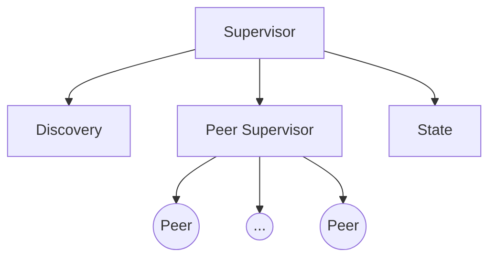

# Ethereum's P2P Protocol Implementation following Actors Model

> [!WARNING]
> This is a work in progress:
>
> - It is not yet ready for use.
> - This module is separate to easy testing, development, and PR preliminary reviews.

## Acknowledgements

We wanted to thank and acknowledge [Commonware](https://commonware.xyz/). Most of this code was inspired by their [`monorepo`](https://github.com/commonwarexyz/monorepo/).

## Design



- `Peer`: actor that represents the RLPx connection to a peer. We do not care if this actor fails.
- `Peer Supervisor`: actor that supervises peers. It just spawns and supervises peers. If a peer fails, we just ignore it. If this actor fails, we need to restart it.
- `Discovery`: actor that handles the discovery protocol. This actor must be restarted if it fails, without affecting the rest of the network.
- `State`: actor that holds the state of the network, this is the Kademlia routing table. If this actor fails, we need to shutdown the network as it is a critical component.
- `Supervisor`: the main actor that supervises the whole network. If this actor fails, we need to shutdown the network.

## Testing Discovery

Run the following and read the logs. CTRL-C to stop.

```
cargo run --release --example discovery
```

## Testing RLPx as Initiator

Run the following and read the logs. CTRL-C to stop.

```
cargo run --release --example rlpx_initiator
```

## Testing RLPx as Receiver

Run the following and read the logs. CTRL-C to stop.

```
cargo run --release --example rlpx_initiator
```
