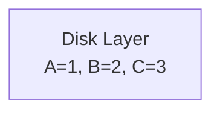
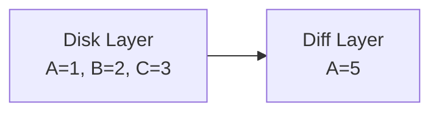
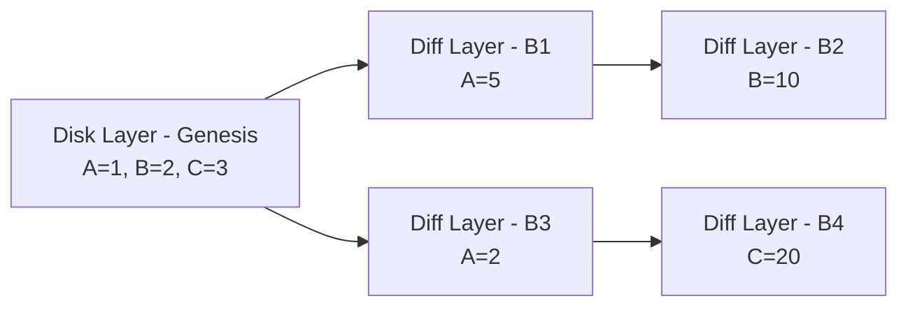
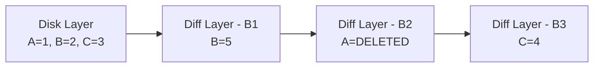
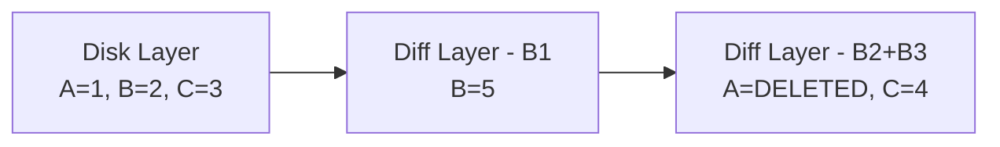
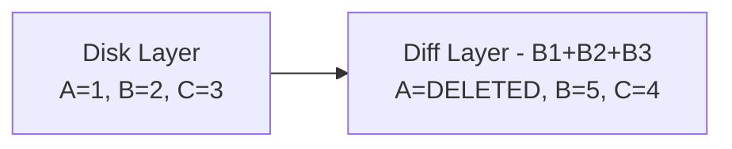
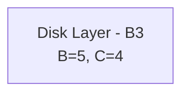

# State Snapshots

The goal of snapshots is to represent the full ethereum state in a flat key-value representation, which is simple and efficient. The whole ethereum state can be represented as:

```rust
struct EthereumState {
    accounts: HashMap<Address, AccountState>,
    storage: HashMap<Address, HashMap<H256, Option<U256>>>,
}
```

## State in detail

### Accounts

That is, we index each account by its address, and hold its state. From `common/types/account.rs`:

```rust
pub struct AccountState {
    pub nonce: u64,
    pub balance: U256,
    pub storage_root: H256,
    pub code_hash: H256,
}
```

For EOAs (`externally owned accounts`, sometimes called user accounts), the only relevant fields are:

- Nonce: the amount of transactions sent to execute by that account. 
- Balance: the amount of wei (minimal division of eth) they have, available to transfer or to pay for transactions.

The other two fields are more relevant to smart contracts:

- Code hash: Smart contracts have bytecode that can be interpreted by the EVM. If we hash the full bytecode, we can use that to have a unique pointer to it.
- Storage root: Smart contracts have storage. Storage is where variables are stored after a transaction is finished. It's persistent between blocks. We save the root for merkleization purposes.

### Storage

There can be a lot written about how solidity or other smart contract programming languages map their variable addresses to storage slots, but that won't be addressed here. For all we care for, each account has a series of storage slots, and we address by hashes, and all of them have `u256` values, which is another way of saying each slot contains a 256-bit word. That is, we can represent the storage for a single account as `HashMap<H256, Option<U256>>`, and the storage for all accounts as `HashMap<Address, HashMap<H256, Option<U256>>>`.

### Actual addressing

However, in tries we don't use the account addresses as keys, we use the hashed addresses so that the trie is naturally balanced, under the assumption that the hashing algorithm is uniformely distributed along its space. To keep snapshots consistent and to be able to iterate in the same order, we used hashes for accounts as well. That means that our real representation for snapshots will be something like this:

```rust
struct EthereumState {
    accounts: HashMap<H256, AccountState>,
    storage: HashMap<H256, HashMap<H256, Option<U256>>>,
}
```

## Layered design

While great for efficient reads and writes, this idea has a problem: reorgs. If we need to rollback state to the previous state to move to a different fork, we need to recalculate everything. The trivial solution would be to save the post-state for every block we execute, so we can just move between states when needed, but that is not feasible (the full mainnet state is 12TB). So what we do instead is to have a full snapshot of a state that is unlikely to be reverted (e.g. 128 blocks in the past) and build in-memory diff-layers on top of it.

### Disk layer

The full snapshot will be called disk-layer and be saved in the db (although it may have a cache on top of it). If we're currently in block N, this will have the full state (accounts and storages) for block N-128.

For example, let's say we have 3 accounts:



### Diff layers

After we execute a block on top of the disklayer, what we do is save all of the updates instead of the full new state. For example if a block has a single transaction changing the state of A from 1 to 5:



The latest difflayer is our current state. If we want to get the value of `A`, we will find it immediately on that difflayer. However, if we want the value of `B`, we well check the diff layer, and when not found, go the previous layer, in this case the disk layer, and find it there.

### Forks

Remember forks? Similar to what we do in tries, we represent each executed block's post state. Let's make our example more complex:



Fork choice tells us which is the current head of the chain by giving us a block hash. That block hash means our current state is the post state after executing that block. If our fork choice says that our current head is `B2`, then our state will be `A=5, B=10, C=3`. If it says that our current head is `B4`, we will have `A=2, B=2, C=20`.

In any case we will stand on top of that leaf and go up the diff tree until we find the value we're looking for.

As a conclusion, for the flat representation we use a snapshot tree: a disklayer as a root, difflayeres on top of it. Our rust representation is:

```rust
pub enum Layer {
    DiskLayer(Arc<DiskLayer>),
    DiffLayer(Arc<RwLock<DiffLayer>>),
}

pub type Layers = HashMap<H256, Layer>; // The key is the block hash
```

## Snapshot operations

Snapshot tree will be mostly used to read values in an efficient way for the execution of a block's transactions. After this, we will have account updates that will need to be applied to the snapshot tree. That means, basically, adding a new difflayer to represent that block's post-state. Those account updates may be simple state changes, or removals.

### State changes

These are what we covered in previous examples. What needs to happen is:

- We use the block's `parent_hash` to get the appropriate parent layer. This may be the disk layer or another diff layer.
- We save the new value for every account and storage in a new difflayer.
- We update the bloom filter (more on that later).

Simple enough, rigth? 

### Removals

We need a way to mark an account or storage slot as removed. For example:



In the example above, if we query the state of account `A` for block `B1`, we should get `1`, and if we do the same query for `B3`, we should get `None`. So we rethink our difflayer struct a bit:

```rust
pub struct DiffLayer {
    accounts: HashMap<H256, Option<AccountState>>,
    storage: HashMap<H256, HashMap<H256, Option<U256>>>
}
```

For both accounts and storage slots, a deletion is represented by a `None` value. That means that if we get the value of `A` at `B3`, we will go up the layers until we find the `None` in `B2`. If we query it for `B1`, we will find the `2` in the disk layer.

## Flattening and disk saving

As you might have asked yourself by now, we can't grow difflayers infinitely. On the one hand, because we can't have all ethereum state in memory. But also, because more layers means adding more steps through the diff traversal, potentially until genesis. If we modify a value in block 1, and now we're in block 2 million, we shouldn't need to traverse 2 million diff layers to get it. This means, that once in a while, we will merge the oldest N diff layers until we have 128 difflayers total. For this, we need a mechanism to merge difflayers.

Merging a difflayer on top of another is simple: we just apply the changes from the new one to the old one. If the value is new, we add it. If the value is different (be it an update or a removal), we update it. Let's say we want to merge all difflayers of the previous example to disk:


First we merge B3 into B2:



Then we merge B2 into B1:



Merging a difflayer on top of the disklayer is commiting changes to disk. That is, inserting or updating accounts and storage slots, but also getting the "None" values and actually removing them from disk.



Also notice that we mark the disk layer as belonging to B3. Disk layers, same as difflayers also have a reference to what block they refer to.

## Edge cases

Reorgs that are more than 128 blocks in the past may happen, although they are not as common. For them we usually just delete the whole snapshot and rebuild one using the trie.

## Optimizations

### Bloom filters

As we will typically have around 128 diff layers, we might have 128 memory in-memory lookups, which is definitely not as bad as going through 5 db jumps in a trie. However, if we had a way to know in advance a value is not in any difflayer and we can go to the disklayer directly, it would still be nice, as a fully optional optimizaiton. To that end, we use a **bloom filter**.

Bloom filters are a structure based on hashing that allows us to represent sets with a single hash. We will not go into implementation details here, but the general abstraction is that they allow us to ask for the question "is this element on the set?" and it may give us two answers:

- Definitely not. In this case, we can go directly to the disk layer without going through all diff layers.
- Maybe yes. When the bloom filters yields a positive answer, it's probabilistic. It's worth going through the diff layers and find out if it's there.

The bloom filter exchanges a highly compact representation with certainty of lookup. But it's designed in a way that if "false" is our answer, we know the element is definitely not in there, which is what we wanted in this case.