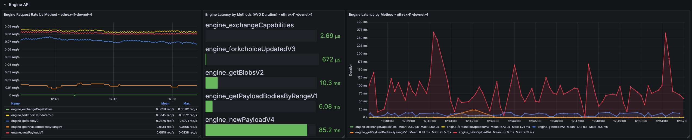
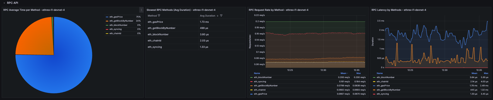
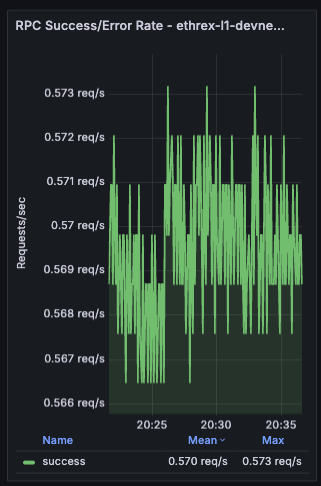

# Ethrex L1 Performance Dashboard (Dec 2025)

Our Grafana dashboard provides a comprehensive overview of key metrics to help developers and operators ensure optimal performance and reliability of their Ethrex nodes. The only configured datasource today is `prometheus`, and the `job` variable defaults to `ethrex L1`, which is the job configured by default in our provisioning.

## How to use it
Use the `network` variable (discovered via the consensus config metric) to scope the view by network, then pick one or more `instance` entries. Every panel honors these selectors. Tip: several panels rely on Grafana transforms such as Organize fields, Join by field, Filter by value, and Group by—keep those in mind if you customize the layout.

## Execution and consensus summary

### Execution Client
Confirms the execution client name, build and network that each monitored instance is running so you can spot mismatched deployments quickly.

### Consensus Fork
Highlights the active fork reported by `ethereum-metrics-exporter`, which is a useful signal during planned upgrades.

## Logs

Collapsed row that allows you to view the logs of the selected instances directly within the dashboard. This is useful for correlating metrics with log events without leaving Grafana.

## Block processing

Row panels showing key block processing metrics across all selected instances.

### Gas Used %
Tracks how much of the block gas limit is consumed across instances, surfacing heavy traffic or underfilled blocks at a glance.

### Ggas/s
Charts gigagas per second to compare execution throughput between nodes and reveal sustained load versus isolated spikes.

### Block Height
Plots the head block seen by each instance so you can immediately detect stalled sync or lagging nodes.

### Ggas/s by Block
Scatter view that ties throughput to the specific block number once all selected instances agree on the same head, making block-level investigations straightforward.

_**Limitations**: This panel only shows data when all selected instances agree on the same head block, and it doesn't handle reorgs gracefully. Here are a couple of things to have in mind when looking at it:_
- During reorgs, we might see weird shapes in the data, with lines at a certain block connected to past ones when more than one slot reorgs happen.
- We could see double measurements for the same block number if reorgs on the same block occur.
- Mean could vary when adding or removing instances, as only blocks agreed upon by all selected instances are shown.

### Block Time
Estimates per-block execution time and lines it up with block numbers, helping you correlate latency spikes with particular blocks.

_**Limitations**: This panel has the same limitations as the "Ggas/s by Block" panel above, as it relies on the same logic to align blocks across instances._

## Block execution breakdown

Collapsed row that surfaces instrumentation from the `add_block_pipeline` and `execute_block_pipeline` timer series so you can understand how each instance spends time when processing blocks. Every panel repeats per instance vertically to facilitate comparisons.

### Block Execution Breakdown pie
Pie chart showing how execution time splits between storage reads, account reads, and non-database work so you can confirm what are the bottlenecks outside of execution itself.

### Execution vs Merkleization Diff %
Tracks how much longer we spend merkleizing versus running the execution phase inside `execute_block_pipeline`. Values above zero mean merkleization dominates; negative readings flag when pure execution becomes the bottleneck (which should be extremely rare). Both run concurrently and merkleization depends on execution, 99% of the actual `execute_block_pipeline` time is just the max of both.

### Block Execution Deaggregated by Block
Plots execution-stage timers (storage/account reads, execution without reads, merkleization) against the block number once all selected instances report the same head.

_**Limitations**: This panel has the same limitations as the other `by block` panels, as it relies on the same logic to align blocks across instances. Can look odd during multi-slot reorgs_

## Engine API

Collapsed row that surfaces the `namespace="engine"` Prometheus timers so you can keep an eye on EL <> CL Engine API health. Each panel repeats per instance to be able to compare behaviour across nodes.

### Engine Total Time per Method
Pie chart that shows where Engine time is spent across methods over the selected range. Quickly surfaces which endpoints dominate total processing time.

### Engine Latency by Methods (Avg Duration)
Bar gauge of the historical average latency per Engine method over the selected time range.

### Engine Request Rate by Method
Shows how many Engine API calls per second we process, split by JSON-RPC method and averaged across the currently selected dashboard range.

### Engine Latency by Method
Live timeseries that tries to correlate to the per-block execution time by showing real-time latency per Engine method with an 18 s lookback window.

_**Limitations**: The aggregated panels pull averages across the current dashboard range, so very short ranges can look noisy while long ranges may smooth out brief incidents. The live latency chart still relies on an 18 s window for calculate the average, which should be near-exact per-block executions but we can lose some intermediary measure._

## RPC API

Another collapsed row focused on the public JSON-RPC surface (`namespace="rpc"`). Expand it when you need to diagnose endpoint hotspots or validate rate limiting. Each panel repeats per instance to be able to compare behaviour across nodes.

### RPC Total Time per Method
Pie chart that shows where RPC time is spent across methods over the selected range. Quickly surfaces which endpoints dominate total processing time.

### Slowest RPC Methods
Table listing the highest average-latency methods over the active dashboard range. Used to prioritise optimisation or caching efforts.

### RPC Request Rate by Method
Timeseries showing request throughput broken down by method, averaged across the selected range.

### RPC Latency by Methods
Live timeseries that tries to correlate to the per-block execution time by showing real-time latency per Engine method with an 18 s lookback window.

_**Limitations**: The RPC latency views inherit the same windowing caveats as the Engine charts: averages use the dashboard time range while the live chart relies on an 18 s window._

## Engine and RPC Error rates

Collapsed row showing error rates for both Engine and RPC APIs side by side and a deagreagated panel by method and kind of error. Each panel repeats per instance to be able to compare behaviour across nodes.

### Engine Success/Error Rate
Shows the rate of successful vs. failed Engine API requests per second.

### RPC Success/Error Rate
Shows the rate of successful vs. failed RPC API requests per second.

### Engine and RPC Errors % by Method and Kind

Deaggregated view of error percentages split by method and error kind for both Engine and RPC APIs. The % are calculated against total requests for a particular method, so all different error percentage for a method should sum up to the percentage of errors for that method.

## Peer Info

Collapsed row providing visibility into the P2P networking layer. Surfaces peer counts, client distribution, and disconnection events to help diagnose connectivity issues and monitor network health. Each panel repeats per instance to compare behaviour across nodes.

### Peer Count
Timeseries showing the number of connected peers over time. Useful for detecting connectivity issues or confirming that the node is maintaining a healthy peer set.

### Peer Clients Distribution
Pie chart breaking down connected peers by client type (e.g., Geth, Nethermind, Besu). Helps understand the diversity of the peer set and spot any client-specific connectivity patterns.

### Peer Clients
Timeseries view of peer counts by client type over time. Useful for tracking how the peer composition evolves and detecting sudden drops in connections to specific client types.

### Peer Disconnection Events
Bar chart showing disconnection events grouped by reason. Helps identify patterns in peer churn and diagnose whether disconnections are due to protocol errors, timeouts, or other causes.

### Disconnections Details
Table providing a detailed breakdown of disconnections by client type and reason over the selected time range. Useful for investigating which clients are disconnecting most frequently and why.

## Process and server info

Row panels showing process-level and host-level metrics to help you monitor resource usage and spot potential issues.

### Uptime
Displays time since the Ethrex process started. _[need proper instance labels]_ 

### Threads
Shows the number of tokio process threads in use. _[need proper instance labels]_

### Open FDs
Reports current file descriptor usage so you can compare against limits. _[need proper instance labels]_

### Open FDs Historic
Time-series view of descriptor usage to spot gradual leaks or sudden bursts tied to workload changes.

### Datadir Size
Tracks database footprint growth, helping you plan disk needs and confirming pruning/compaction behavior.

### Node CPU (avg. cores used)
Shows effective CPU cores consumed by each instance, separating sustained computation from short-lived bursts.

### Node Memory (RSS)
Follows the resident memory footprint of the Ethrex process so you can investigate leaks or pressure.

### Host CPU Utilization (%)
Uses node exporter metrics to track whole-host CPU load and distinguish client strain from other processes on the server.

### Host RAM (GiB) - Used vs Total
Compares used versus total RAM to highlight when machines approach memory limits and need attention.

## Block building (WIP)

This collapsed row offers a combined view of the block building base fee, gigagas per second during payload construction, and the time the builder spends assembling blocks. These panels are works in progress, collapsed by default, and may be refined over time.

