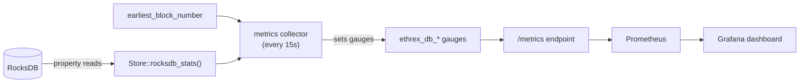

# DB observability

Ethrex exports granular RocksDB metrics so you can see, continuously and per
column family, what the on-disk database is made of, how it grows, how the block
cache and compactions behave, and how far the [historical chain
backfill](../../l1/fundamentals/history_backfill.md) has progressed.

The metrics are named `ethrex_db_*` and are published to the same Prometheus
endpoint as the rest of ethrex's metrics, so they need no extra wiring — a
pre-built Grafana dashboard renders them out of the box.

## Enabling it

1. Build with the `metrics` feature and start the node with `--metrics` (see
   [Monitoring and metrics](../../l1/running/monitoring.md)). A collector then
   samples the database every 15 s and updates the gauges. It is a no-op for the
   in-memory backend.
2. *(Optional)* Set `ETHREX_ROCKSDB_STATISTICS=1` to enable RocksDB's internal
   statistics, which populate the block-cache **hit/miss** counters
   (`ethrex_db_block_cache_hits_total` / `_misses_total`). This adds a small
   (~1–2%) overhead and is off by default; every other metric works without it.

The `ethrex DB Observability` dashboard is provisioned automatically from
`metrics/provisioning/grafana/dashboards/common_dashboards/db_dashboard.json`
alongside the other [dashboards](./dashboards.md).

## Metrics

All gauges carry the Prometheus `instance` label; per-column-family gauges also
carry a `cf` label (`bodies`, `receipts_v2`, `transaction_locations`, `headers`,
`account_trie_nodes`, `storage_trie_nodes`, `account_flatkeyvalue`,
`storage_flatkeyvalue`, `account_codes`, …).

### Per column family

| Metric | Meaning |
| --- | --- |
| `ethrex_db_cf_size_bytes` | Live SST bytes on disk |
| `ethrex_db_cf_total_sst_bytes` | Total SST bytes including not-yet-compacted (space amplification) |
| `ethrex_db_cf_live_data_bytes` | Estimated live (logical) data bytes |
| `ethrex_db_cf_num_keys` | Estimated number of keys |
| `ethrex_db_cf_num_files` | Live SST file count |
| `ethrex_db_cf_blob_bytes` | Live blob-file bytes (used by `account_codes`) |
| `ethrex_db_cf_pending_compaction_bytes` | Estimated pending-compaction bytes (write debt) |
| `ethrex_db_cf_memtable_bytes` | Current memtable bytes |

### Database-wide

| Metric | Meaning |
| --- | --- |
| `ethrex_db_total_live_sst_bytes` | Total live SST bytes across all column families |
| `ethrex_db_block_cache_usage_bytes` | Shared block-cache bytes in use |
| `ethrex_db_block_cache_capacity_bytes` | Shared block-cache capacity |
| `ethrex_db_block_cache_pinned_bytes` | Block-cache bytes pinned (index/filter blocks) |
| `ethrex_db_running_compactions` | Currently running compactions |
| `ethrex_db_block_cache_hits_total` | Cumulative block-cache hits (requires `ETHREX_ROCKSDB_STATISTICS`) |
| `ethrex_db_block_cache_misses_total` | Cumulative block-cache misses (requires `ETHREX_ROCKSDB_STATISTICS`) |
| `ethrex_db_backfill_frontier_block` | Lowest block with full chain data on disk (the backfill frontier / `earliest_block_number`) |

## The dashboard

`ethrex DB Observability` is organized into five rows:

- **Overview** — total DB size, backfill frontier, blocks still above the merge
  floor, running compactions, and total size over time.
- **Per-Column-Family Sizes** — stacked composition over time, current size by
  column family, and a per-CF detail table (size, live data, keys, files,
  pending compaction, blob bytes).
- **Growth / Deltas Over Time** — total and per-CF growth rate (30 m derivative)
  plus 1 h / 6 h / 24 h size deltas.
- **Historical Chain Backfill** — the frontier descending toward the merge floor,
  and the growth of the column families backfill writes into (`bodies`,
  `receipts_v2`, `transaction_locations`).
- **Read / Performance Internals** — block-cache usage vs. capacity, hit ratio
  (needs statistics enabled), pending-compaction debt, SST file counts, memtable
  bytes, and running compactions.

## How it fits together

The collector reads cheap RocksDB properties (per-column-family sizes/keys/files,
block cache, compaction counters) via `Store::rocksdb_stats()` and the backfill
frontier via `earliest_block_number`, then updates the `ethrex_db_*` gauges. The
gauges register into the Prometheus default registry, so the existing metrics API
exposes them with no further changes.

## References

- [Monitoring and metrics](../../l1/running/monitoring.md) — enabling metrics and the Docker monitoring stack.
- [Metrics](./metrics.md) and [Dashboards](./dashboards.md) — the rest of ethrex's metrics and Grafana dashboards.
- [Historical chain backfill](../../l1/fundamentals/history_backfill.md) — the feature the frontier metric tracks.
- [Databases](../../l1/fundamentals/databases.md) — store schema versioning.
