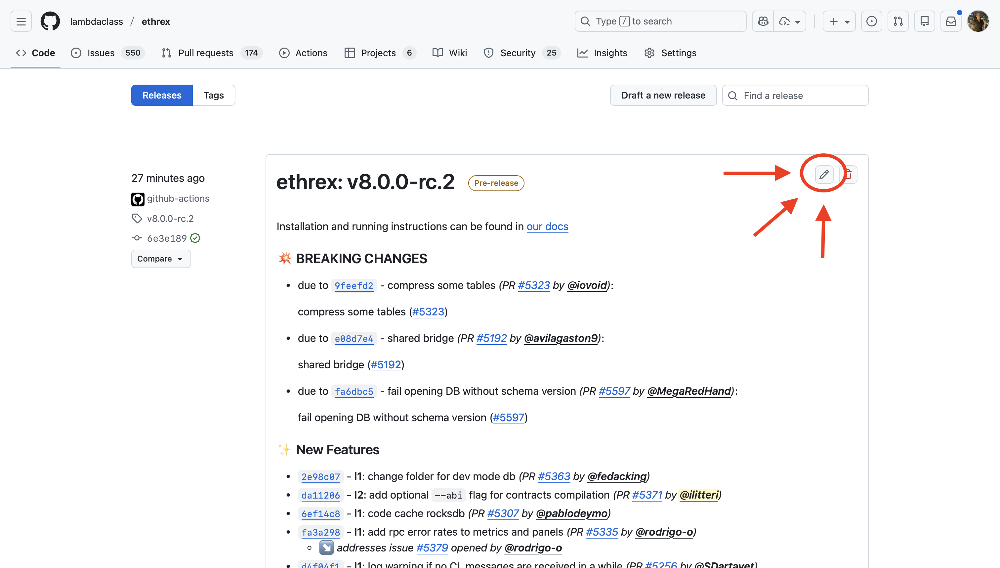
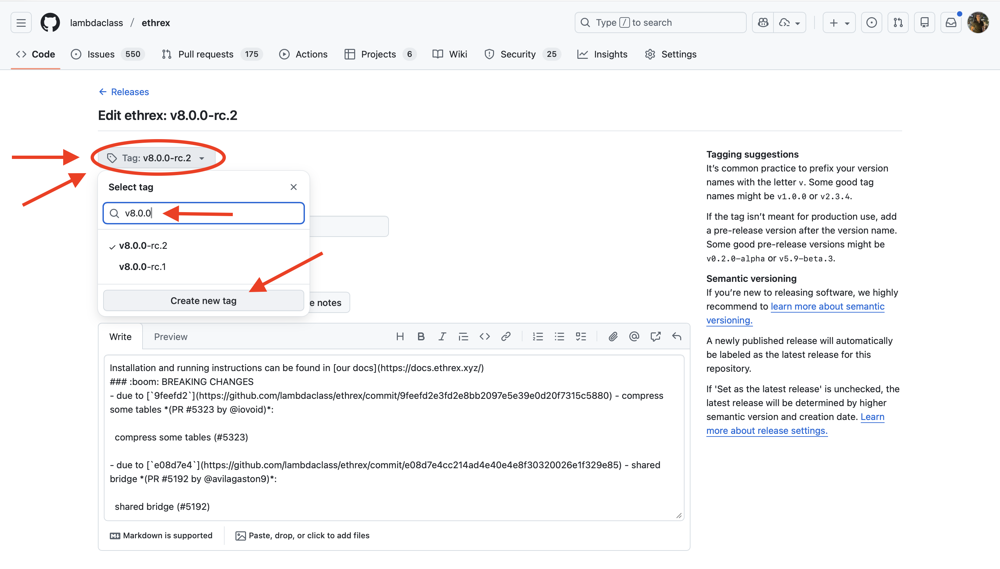
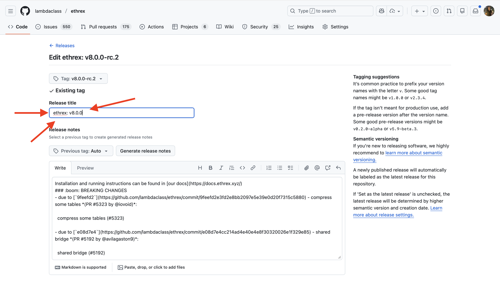
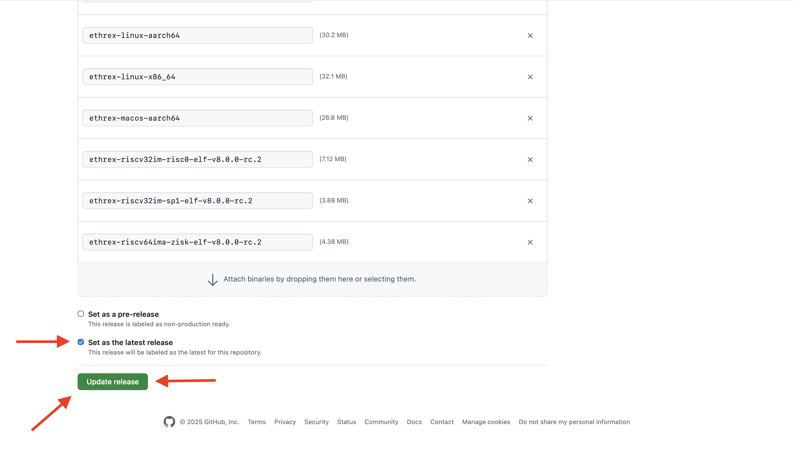

# How to Release an ethrex version

Releases are prepared from dedicated release branches and tagged using versioning.

## 1st - Create release branch

Branch name must follow the format `release/vX.Y.Z`.

Examples:

- `release/v1.2.0`
- `release/v3.0.0`
- `release/v3.2.0`

## 2nd - Bump version

The version must be updated to `X.Y.Z` in the release branch. There are multiple `Cargo.toml` and `Cargo.lock` files that need to be updated.

First, we need to update the version of the workspace package. You can find it in the `Cargo.toml` file in the root directory, under the `[workspace.package]` section. This is also the version the library crates are published under on crates.io when the release is finalized, so it must be a clean semver version (the `-rc.W` suffix lives only on the git tag).

Then, we need to update five more `Cargo.toml` files that are not part of the workspace but fulfill the role of packages in the monorepo. These are located in the following paths:

- `crates/guest-program/bin/sp1/Cargo.toml`
- `crates/guest-program/bin/risc0/Cargo.toml`
- `crates/guest-program/bin/zisk/Cargo.toml`
- `crates/guest-program/bin/openvm/Cargo.toml`
- `crates/l2/tee/quote-gen/Cargo.toml`

After updating the version in the `Cargo.toml` files, we need to update the `Cargo.lock` files to reflect the new versions. Run `make update-cargo-lock` from the root directory to update all the `Cargo.lock` files in the repository. You should see changes in at most the following paths:

- In the root directory
- `crates/guest-program/bin/sp1/Cargo.lock`
- `crates/guest-program/bin/risc0/Cargo.lock`
- `crates/guest-program/bin/zisk/Cargo.lock`
- `crates/guest-program/bin/openvm/Cargo.lock`
- `crates/l2/tee/quote-gen/Cargo.lock`
- `crates/vm/levm/bench/revm_comparison/Cargo.lock`
- `tooling/Cargo.lock`

Then, go to the `CLI.md` file located in `docs/` and update the version of the `--builder.extra-data` flag default value to match the new version (for both ethrex and ethrex l2 sections).

Finally, stage and commit the changes to the release branch.

An example of a PR that bumps the version can be found [here](https://github.com/lambdaclass/ethrex/pull/4881/files#diff-2e9d962a08321605940b5a657135052fbcef87b5e360662bb527c96d9a615542).

## 3rd - Create & Push Tag

Create a tag with a format `vX.Y.Z-rc.W` where `X.Y.Z` is the semantic version and `W` is a release candidate version. Other names for subversions are also accepted. Example of valid tags:

- `v0.1.3-rc.1`
- `v0.0.2-alpha`

```bash
git tag <release_version>
git push origin <release_version>
```

After pushing the tag, a CI job will compile the binaries for different architectures and create a pre-release with the version specified in the tag name. Along with the binaries, a tar file is uploaded with the contracts and the verification keys. The following binaries are built:

| name | L1 | L2 stack | Provers | CUDA support |
| --- | --- | --- | --- | --- |
| ethrex-linux-x86-64 | ✅ | ❌ | - | - |
| ethrex-linux-aarch64 | ✅ | ❌ | - | - |
| ethrex-linux-macos-aarch64 | ✅ | ❌ | - | - |
| ethrex-l2-linux-x86-64 | ✅ | ✅ | SP1 - RISC0 - Exec | ❌ |
| ethrex-l2-linux-x86-64-gpu | ✅ | ✅ | SP1 - RISC0 - Exec | ✅ |
| ethrex-l2-linux-aarch64 | ✅ | ✅ | SP1 - Exec | ❌ |
| ethrex-l2-linux-aarch64-gpu| ✅ | ✅ | SP1 - Exec | ✅ |
| ethrex-l2-macos-aarch64 | ✅ | ✅ | Exec | ❌ |

Also, two docker images are built and pushed to the Github Container registry:
- `ghcr.io/lambdaclass/ethrex:X.Y.Z-rc.W`
- `ghcr.io/lambdaclass/ethrex:X.Y.Z-rc.W-l2`

A changelog will be generated based on commit names (using conventional commits) from the last stable tag.

## 4th - Test & Publish Release

### Testing checklist

Before publishing the release, run through the following checks using the pre-release binaries:

- [ ] Upgrade `ethrex-ethdocker-mainnet`
- [ ] Upgrade `ethrex-mainnet-1`
- [ ] Upgrade `ethrex-minimum-mainnet`
- [ ] Launch multisync on `ethrex-multisync-main`
- [ ] Upgrade a local L2 created with the previous version and run the integration tests
- [ ] Run the L2 integration tests with a SP1 prover on the GPU server (`l2-gpu`)

### Publish

Once the pre-release is created and you want to publish the release, go to the [release page](https://github.com/lambdaclass/ethrex/releases) and follow the next steps:

1. Click on the edit button of the last pre-release created

    

2. Manually create the tag `vX.Y.Z`

    

3. Update the release title

    

4. Customize the release notes.

    The auto-generated changelog lists every commit, but it doesn't tell operators what actually matters in this release. Above the auto-generated changelog, add a hand-written summary using [GitHub alerts](https://docs.github.com/en/get-started/writing-on-github/getting-started-with-writing-and-formatting-on-github/basic-writing-and-formatting-syntax#alerts). Pick boxes by what the operator needs to decide, in this order:

    - `> [!IMPORTANT]` — **only** when the release carries critical security or correctness fixes. One line stating that upgrading is strongly recommended for all operators.
    - `> [!WARNING]` — **only** when the upgrade can't be cleanly undone or carries a breaking change the operator must account for: a database schema migration you can't roll back from, a required resync, removed or renamed CLI flags / config options, changed defaults, breaking RPC/API changes, or new minimum requirements (disk, dependency, consensus-client version). State what changes and what the operator must do.
    - `> [!NOTE]` — **always**. A **What's new** list of the highlights (new features, important fixes), plus a line saying whether a resync is needed (if not already covered above).

    Keep the space after `>` (`> [!NOTE]`, not `>[!NOTE]`) and leave a blank line between boxes so each renders separately. Drop the `[!IMPORTANT]` / `[!WARNING]` boxes when they don't apply — a routine release needs only the `[!NOTE]`.

    ```markdown
    > [!IMPORTANT]
    > This release contains critical fixes. Upgrading is strongly recommended for all operators.

    > [!WARNING]
    > This release changes the database schema; once you upgrade you can't roll back to a previous version. The migration runs automatically.

    > [!NOTE]
    > **What's new**
    > - <highlight>
    > - <highlight>
    >
    > No resync is needed.
    ```

5. Set the release as the latest release (you will need to uncheck the pre-release first). And finally, click on `Update release`

    

> [!IMPORTANT]
> Do the tag rename (`vX.Y.Z-rc.W` → `vX.Y.Z`) **and** unchecking *pre-release* in a **single** `Update release` edit. The automatic promotion fires on that one edit because it both renames the tag and clears the pre-release flag; splitting it across two saves means neither edit carries both signals and the `latest` tag is not moved. If that happens, use the manual recovery in [Troubleshooting](#failure-on-latest-release-workflow).

Once done, the `Ethrex Latest Release` workflow (triggered by that edit) will publish new tags for the already compiled docker images:

- `ghcr.io/lambdaclass/ethrex:X.Y.Z`, `ghcr.io/lambdaclass/ethrex:latest`
- `ghcr.io/lambdaclass/ethrex:X.Y.Z-l2`, `ghcr.io/lambdaclass/ethrex:l2`

Promoting the pre-release to a full release also publishes ethrex's library crates to crates.io — see the next section.

### Publishing to crates.io

Promoting the pre-release to a full release (the `released` event from the step above) triggers the `publish.yml` workflow, which runs `cargo publish` for ethrex's publishable library crates in dependency order, at the workspace version `X.Y.Z`.

> [!NOTE]
> Only the **final** release publishes to crates.io. Pre-release (`vX.Y.Z-rc.W`) tags do **not**: the `released` event does not fire for pre-releases, and crates.io versions are immutable, so a release candidate must never claim the version before it has been tested.

The crates are published at the `[workspace.package].version` bumped in step 2; the `-rc.W` suffix lives only on the git tag and never reaches crates.io.

This requires a one-time organizational setup before the first release that publishes:

- A `CRATES_IO_TOKEN` repository secret with publish rights for the crates.
- A `crates-release-prod` GitHub environment (the workflow runs inside it).
- crates.io ownership of the crate names (the first publish under the token claims them).

The workflow is idempotent: a crate version already on crates.io is skipped, so re-running after a partial failure is safe. To validate without publishing, run it manually from the Actions tab (the `workflow_dispatch` trigger) with the dry-run input checked — it lists each crate's package contents instead of publishing.

## 5th - Update Homebrew

Disclaimer: We should automate this

1. Commit a change in https://github.com/lambdaclass/homebrew-tap/ bumping the ethrex version (like [this one](https://github.com/lambdaclass/homebrew-tap/commit/d78a2772ad9c5412e7f84c6210bd85c970fcd0e6)).
    - The first SHA is the hash of the `.tar.gz` from the release. You can get it by downloading the `Source code (tar.gz)` from the ethrex release and running

        ```bash
        shasum -a 256 ethrex-v3.0.0.tar.gz
        ```

    - For the second one:
        - First download the `ethrex-l2-macos-aarch64` binary from the ethrex release
        - Give exec permissions to binary

            ```bash
            chmod +x ethrex-l2-macos-aarch64
            ```

        - Create a dir `ethrex/3.0.0/bin` (replace the version as needed)
        - Move (and rename) the binary to `ethrex/3.0.0/bin/ethrex` (the last `ethrex` is the binary)
        - Remove quarantine flags (in this case, `ethrex` is the root dir mentioned before):

            ```bash
            xattr -dr com.apple.metadata:kMDItemWhereFroms ethrex
            xattr -dr com.apple.quarantine ethrex
            ```

        - Tar the dir with the following name (again, `ethrex` is the root dir):

            ```bash
            tar -czf ethrex-3.0.0.arm64_sonoma.bottle.tar.gz ethrex
            ```

        - Get the checksum:

            ```bash
            shasum -a 256 ethrex-3.0.0.arm64_sonoma.bottle.tar.gz
            ```

        - Use this as the second hash (the one in the `bottle` section)
2. Push the commit
3. Create a new release with tag `v3.0.0`. **IMPORTANT**: attach the `ethrex-3.0.0.arm64_sonoma.bottle.tar.gz` to the release

## 6th - Merge the release branch via PR

Once the release is verified, **merge the branch via PR**.

## Dealing with hotfixes

If hotfixes are needed before the final release, commit them to `release/vX.Y.Z`, push, and create a new pre-release tag. The final tag `vX.Y.Z` should always point to the exact commit you will merge via PR.

## Troubleshooting

### Failure on "latest release" workflow

If the `latest` / `l2` Docker tags don't get updated after step 5 (the `Ethrex Latest Release` run skipped the retag, or its `assert-latest-promoted` job failed), recover with the workflow's manual path — no local Docker or PAT needed:

- Go to **Actions → Ethrex Latest Release → Run workflow**.
- Set `rc_tag` to the tested release candidate (e.g. `v18.0.0-rc.1`) and `version` to the final version (e.g. `v18.0.0`).
- Run it. The run retags `latest` / `l2` / `performance` / `X.Y.Z` from the RC image, publishes the apt package, and the `verify-latest` job confirms `:latest` resolves to `:X.Y.Z` (the run goes red if it doesn't).

If the registry itself is the problem and you need to push tags by hand, fall back to a local retag:

- Create a new Github Personal Access Token (PAT) from the [settings](https://github.com/settings/tokens/new).
- Check `write:packages` permission (this will auto-check `repo` permissions too), give a name and a short expiration time.
- Save the token securely.
- Click on `Configure SSO` button and authorize LambdaClass organization.
- Log in to Github Container Registry: `docker login ghcr.io`. Put your Github's username and use the token as your password.
- Pull RC images:

```bash
docker pull --platform linux/amd64 ghcr.io/lambdaclass/ethrex:X.Y.Z-rc.W
docker pull --platform linux/amd64 ghcr.io/lambdaclass/ethrex:X.Y.Z-rc.W-l2
```

- Retag them:

```bash
docker tag ghcr.io/lambdaclass/ethrex:X.Y.Z-rc.W ghcr.io/lambdaclass/ethrex:X.Y.Z
docker tag ghcr.io/lambdaclass/ethrex:X.Y.Z-rc.W-l2 ghcr.io/lambdaclass/ethrex:X.Y.Z-l2
docker tag ghcr.io/lambdaclass/ethrex:X.Y.Z-rc.W ghcr.io/lambdaclass/ethrex:latest
docker tag ghcr.io/lambdaclass/ethrex:X.Y.Z-rc.W-l2 ghcr.io/lambdaclass/ethrex:l2
```

- Push them:

```bash
docker push ghcr.io/lambdaclass/ethrex:X.Y.Z
docker push ghcr.io/lambdaclass/ethrex:X.Y.Z-l2
docker push ghcr.io/lambdaclass/ethrex:latest
docker push ghcr.io/lambdaclass/ethrex:l2
```

- Delete the PAT for security ([here](https://github.com/settings/tokens))

### Failure on the crates.io publish workflow

If `publish.yml` fails partway through, fix the cause and re-run the workflow. Crates already published at the release version are skipped (the run tolerates an "already exists" error), so it resumes from the first crate that has not been published yet. Because crates are published in dependency order, a metadata or ordering error in one crate blocks the crates that depend on it, while the ones published before it stay published (crates.io versions cannot be unpublished or overwritten — a fix requires a new version).
