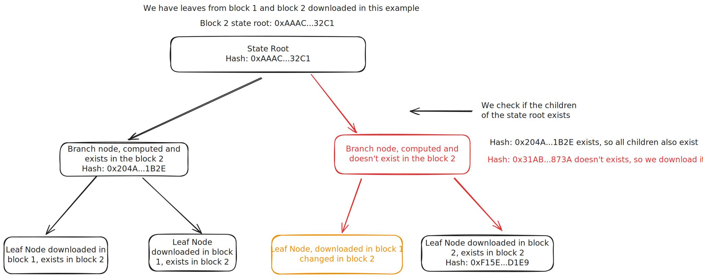
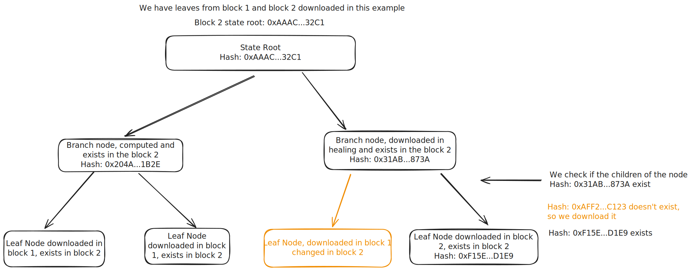

# Healing Algorithm Explanation and Documentation (Before Path Based)

Healing is the last step of Snap Sync. Snap begins the downloading of the state and storage tries by downloading the leaves (account states and storage slots), and from those leaves we reconstruct the intermediate nodes (branches and extension). Afterwards we may be left with a malformed trie, as that step will resume the download of leaves with a new state root if the old one times out.

The purpose of the healing algorithm is “heal” that trie so that it ends up in a consistent state.

# Healing Conceptually

The malformed trie is going to have large sections of the trie which are in a correct state, as we had all of the leaves in that sections and those accounts haven’t been modified in the blocks that happened concurrently to the snapsync algorithm.


Example of a trie where 3 leaves where downloaded in block 1 and 1 was downloaded in block 2. The trie root is different from the state root of block 2, as one of the leaf nodes was modified in block 2.

The algorithm attempts to rebuild the trie through downloading the missing nodes, starting from the top. If the node is present in the database that means that we have that and all of their child nodes present in the database. If not, we download the node and check if the children of the root are present, applying the algorithm recursively.


Iteration 1 of algorithm



Iteration 2 of algorithm



Iteration 3 of algorithm


Final state of trie after healing

# Implementation

The algorithm is implemented in ethrex currently in `crates/networking/p2p/sync/state_healings.rs` and `crates/networking/p2p/sync/storage_healing.rs`. All of our code examples are from the account state trie.

### API

The API used is the ethereum capability snap/1, documented at https://github.com/ethereum/devp2p/blob/master/caps/snap.md and for healing the only method used is `GetTrieNodes`. This method allows us to ask our peers for nodes in a trie. We ask the nodes by **path** to the node, not by hash. 

```rust
pub struct GetTrieNodes {    
    pub id: u64,    
    pub root_hash: H256,    
    // [[acc_path, slot_path_1, slot_path_2,...]...]    
    // The paths can be either full paths (hash) or 
    // only the partial path (compact-encoded nibbles)    
    pub paths: Vec<Vec<Bytes>>,    
    pub bytes: u64,
}
```

### Staleness

The spec allows the nodes to stop responding if the request is older than 128 blocks. In that case, the response to the `GetTrieNodes` will be empty. As such, our algorithm checks periodically if the block is stale, and stops executing. In that scenario, we must be sure that the we leave the storage in a consistent state at any given time and doesn’t break our invariants.

```rust
// Current Staleness logic code
// We check with a clock if we are stale        
if !is_stale && current_unix_time() > staleness_timestamp {
    info!("state healing is stale");            
    is_stale = true;       
}
// We make sure that we have stored everything that we need to the database
if is_stale && nodes_to_heal.is_empty() && inflight_tasks == 0 {
  info!("Finished inflight tasks");            
  db_joinset.join_all().await;            
  break;
}
```

### Membatch

Currently, our algorithm has an invariant, which is that if we have a node in storage we have its and all of its children are present. Therefore, when we download for a node if some of it’s children are missing we can’t immediately store it on disk. Our implementation currently stores the nodes in temporary structure called membatch, which stores the node and how many of it’s children are missing. When a child gets stored, we reduce the counter of missing children of the parent. If that numbers reaches 0, we write the parent to the database.

In code, the membatch is current `HashMap<Nibbles, MembatchEntryValue>` with the value being the following struct 

```rust
pub struct MembatchEntryValue {
    /// The node to be flushed into storage
    node: Node,
    /// How many of the nodes that are child of this are not in storage
    children_not_in_storage_count: u64,
    /// Which is the parent of this node
    parent_path: Nibbles,
}
```

## Known Optimization Issues

- Membatch gets cleared between iterations, while it could be preserved and the hash checked.
- When checking if a child is present in storage, we can also check if it’s in the membatch. If it is, we can skip that download and act like we have immediately downloaded that node.
- Membatch is currently a `HashMap`, a `BTreeMap` or other structures may be faster in real use.
- Storage healing receives as a parameter a list of accounts that need to be healed and it has get their state before it can run. Doing those reads could be more efficient.
