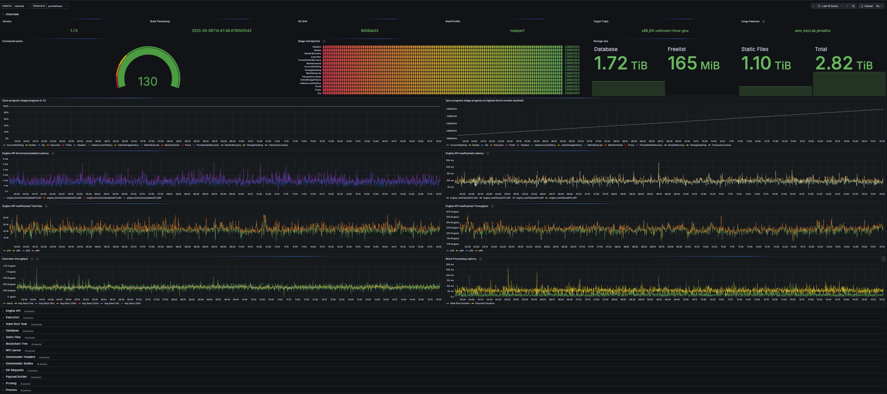

# Ethrex L1 Metrics Coverage

## Scope
This note tracks the current state of metrics and dashboard observability for the L1, highlights the gaps against a cross-client baseline. It covers runtime metrics exposed through our crates, the existing Grafana "Ethrex L1 - Perf" dashboard, and supporting exporters already wired in provisioning.

### At a glance
- **Covered today**: Block execution timings, gas throughput, and host/process health are exported and graphed through `metrics/provisioning/grafana/dashboards/common_dashboards/ethrex_l1_perf.json`.
- **Missing**: Sync/peer awareness, txpool depth, Engine API visibility, JSON-RPC health, and state/storage IO metrics are absent or only logged.
- **Near-term focus**: Ship sync & peer gauges, surface txpool counters we already emit, and extend instrumentation around Engine API and storage before adding alert rules.

## Baseline We Compare Against
The gap analysis below uses a cross-client checklist we gathered after looking at Geth, Nethermind, and Reth metrics and dashboard setups; this works as a baseline of "must-have" coverage for execution clients. The key categories are:
- **Chain sync & finality**: head vs peer lag, stage progress, finalized/safe head distance, sync ETA.
- **Peer health**: active peers, connected peer roles, snap-capable availability, ingress/egress traffic.
- **Block & payload pipeline**: gas throughput, execution breakdown timings, block import failures, payload build latency.
- **Transaction pool**: pending depth per type, drop/evict counters, gossip ingress/egress rate, TPS trend.
- **Engine API & RPC**: call success ratios, latency histograms for Engine and JSON-RPC methods, error taxonomy.
- **State & storage**: db size, read/write bytes, cache hit/miss, heal backlog, pruning progress.
- **Process & host health**: CPU, memory, FDs, uptime, disk headroom (usually covered by node_exporter but treated as must-have).
- **Error & anomaly counters**: explicit counters for reorgs, failed imports, sync retries, bad peer events.

Snapshot: October 2025.

| Client | Dashboard snapshot | Depth (5) |
| --- | --- | --- |
| Geth |  | ★★★ |
| Nethermind |  | ★★★★ |
| Reth |  | ★★★★★ |

Some good resources for reference:
- [Understanding Geth's dashboard](https://geth.ethereum.org/docs/monitoring/understanding-dashboards)
- [Nethermind's metrics](https://docs.nethermind.io/monitoring/metrics/)
- [Reth's observability](https://reth.rs/run/monitoring/#observability-with-prometheus--grafana)

## Current Instrumentation
Ethrex exposes the metrics API by default when the CLI `--metrics` flag is enabled, and Prometheus/Grafana wiring is part of the provisioning stack. The table below stacks our current coverage against the reference clients for each essential bucket.

| Bucket | Geth | Nethermind | Reth | Ethrex |
| --- | --- | --- | --- | --- |
| Sync & head tracking | Yes | Yes | Yes | Partial (head height only) |
| Peer connectivity | Yes | Yes | Yes | No |
| Txpool visibility | Yes (basic) | Yes | Yes | Partial (counters, no panels) |
| Block execution latency | Yes | Yes | Yes | Yes |
| Throughput (MGas/s) | Partial (derived) | Yes | Yes | Yes |
| State / DB IO | Yes | Yes | Yes | Partial (datadir size only) |
| Engine API telemetry | Partial (metrics exist, limited panels) | Yes | Yes | No |
| Reorg & error counters | Yes | Yes | Partial (basic) | No |
| Pruning metrics | No | Yes | Yes | No |
| System resources | Yes | Yes | Yes | Yes (node exporter + process) |

- **Block execution pipeline**
  - Gauges exposed in `crates/blockchain/metrics/metrics_blocks.rs`: `gas_limit`, `gas_used`, `gigagas`, `block_number`, `head_height`, `execution_ms`, `merkle_ms`, `store_ms`, `transaction_count`, plus block-building focused gauges that need to be reviwed first (`gigagas_block_building`, `block_building_ms`, `block_building_base_fee`).
  - Updated on the hot path in `crates/blockchain/blockchain.rs`, `crates/blockchain/payload.rs`, and `crates/blockchain/fork_choice.rs`; block-building throughput updates live in `crates/blockchain/payload.rs`.
  - Exposed via `/metrics` when the `metrics` feature or CLI flag is enabled and visualised in Grafana panels "Gas Used %", "Ggas/s", "Ggas/s by Block", "Block Height", and "Block Execution Breakdown" inside `metrics/provisioning/grafana/dashboards/common_dashboards/ethrex_l1_perf.json`.
- **Transaction pipeline**
  - `crates/blockchain/metrics/metrics_transactions.rs` defines counters and gauges: `transactions_tracker{tx_type}`, `transaction_errors_count{tx_error}`, `transactions_total`, `mempool_tx_count{type}`, `transactions_per_second`.
  - L1 currently uses the per-type success/error counters via `metrics!(METRICS_TX...)` in `crates/blockchain/payload.rs`. Aggregate setters (`set_tx_count`, `set_mempool_tx_count`, `set_transactions_per_second`) are only invoked from the L2 sequencer (`crates/l2/sequencer/metrics.rs` and `crates/l2/sequencer/block_producer.rs`).
  - No Grafana panels surface these metrics yet, despite being scraped.
- **Process & storage footprint**
  - `crates/blockchain/metrics/metrics_process.rs` registers Prometheus' process collector (available on Linux) and provides `datadir_size_bytes` when the CLI passes the datadir path.
  - Grafana reuses the emitted `datadir_size_bytes` for "Datadir Size" and relies on node_exporter panels for CPU, RSS, open FDs, and host resource graphs in the "Process & Server Info" row.
- **Tracing-driven profiling**
  - `crates/blockchain/metrics/profiling.rs` installs a `FunctionProfilingLayer` whenever the CLI `--metrics` flag is set. Histograms (`function_duration_seconds{function_name}`) capture tracing span durations across block processing.
  - Grafana does not yet visualise these histograms, but Prometheus scrapes them for ad-hoc queries.
- **Metrics API**
  - `crates/blockchain/metrics/api.rs` exposes `/metrics` and `/health`; orchestration defined in `cmd/ethrex/initializers.rs` ensures the Axum server starts alongside the node when metrics are enabled.
  - The provisioning stack (docker-compose, Makefile targets) ships Prometheus and Grafana wiring, so any new metric family automatically appears in the scrape.

## General pitfalls
Before addressing the gaps listed below, we should also consider some general pitfalls in our current metrics setup:

- **No namespace standardisation**: Metric names and labels should follow a consistent naming convention (e.g., `ethrex_` prefix) to avoid collisions and improve clarity. We should also probably add l1/l2 prefixes where applicable.
- **No label consistency**: We are not using labels consistently, especially in l1. We might need to take a pass to ensure similar metrics use uniform label names and values to facilitate querying and aggregation.
- **Exemplar where applicable**: For histograms, adding exemplars can help trace high-latency events back to specific traces/logs. This is especially useful for latency-sensitive metrics like block execution time or RPC call durations where we could add block hashes as exemplars. This needs to be evaluated on a case-by-case basis and tested.

## Coverage vs Baseline Must-Haves

| Bucket | Have today | Missing / next steps |
| --- | --- | --- |
| Chain sync status | `METRICS_BLOCKS.head_height` surfaced in `crates/blockchain/fork_choice.rs`; Grafana shows head height trend. | Need best-peer lag, stage progress, ETA. Counters live only in logs via `periodically_show_peer_stats_during_syncing` (`crates/networking/p2p/network.rs`). |
| Peer connectivity & network | `net_peerCount` RPC is available. | No Prometheus gauges for active peers, peer limits, or snap capability; no networking row on the dashboard. |
| Block & transaction throughput | `METRICS_BLOCKS` captures gas throughput and execution stage timings; per-block tx count already charted. | Add histograms (p50/p95) for execution breakdown, block import failure counters, and an L1-driven TPS gauge. |
| Resource utilisation | Process collector + `datadir_size_bytes` in `crates/blockchain/metrics/metrics_process.rs`; node_exporter covers host basics. | Need cache hit/miss visibility, RocksDB compaction backlog, IO rate gauges. |
| State & storage health | Only datadir size today. | Export healing/download progress, snapshot sync %, DB read/write throughput, pruning/backfill counters. |
| Transaction pool health | Success/error counters per tx type emitted from `crates/blockchain/payload.rs`. | No exported pending depth, blob/regular split, drop reasons, or gossip throughput; aggregates exist only in L2 (`crates/l2/sequencer/metrics.rs`). |
| Error counters & anomalies | None published. | Add Prometheus counters for failed block imports, reorg depth, RPC errors, Engine API retries, sync failures. |
| Engine API metrics | None published. | Instrument `newPayload`, `forkChoiceUpdated`, `getPayload` handlers with histograms/counters; track payload build outcomes in `crates/blockchain/payload.rs`. |
| Consensus / sync quality | None published. | Need finalized vs safe vs head lag, healing backlog, stage-by-stage completion gauges. |
| JSON-RPC health | None published. | Add per-method call rate/latency/error metrics around `crates/networking/rpc` handlers and surface in Grafana. |

### Next steps
1. Implement sync & peer metrics (best-peer lag, stage progress) and add corresponding Grafana row.
2. Wire L1 into the existing `METRICS_TX` aggregates and ship txpool panels.
3. Instrument Engine API handlers with histograms/counters; plan storage IO metrics in parallel.
4. Revisit histogram buckets and naming conventions once new metrics are merged, then define alert thresholds.