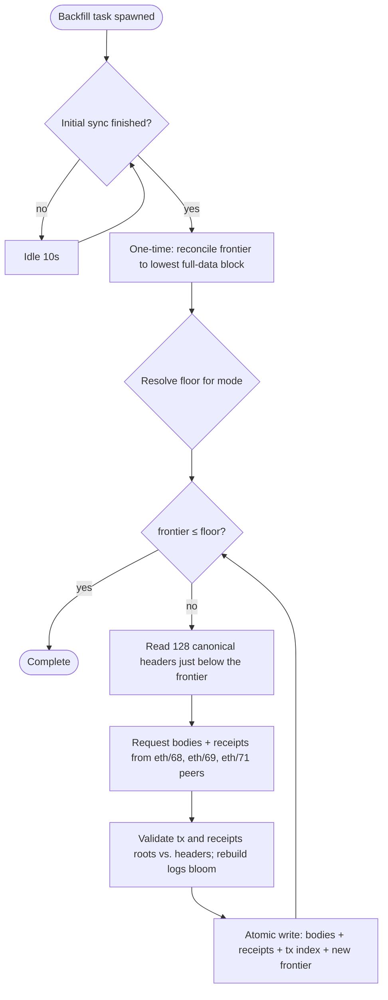

# Historical chain backfill

A snap-synced node backfills only block **headers** below the sync pivot; it does
not download the block bodies or receipts for pre-pivot blocks. As a result,
historical RPC queries for those blocks return empty:
`eth_getBlockByNumber`/`ByHash`, `eth_getBlockReceipts`,
`eth_getTransactionByHash`, and `eth_getTransactionReceipt` return `null`, and
`eth_getLogs` over a pre-pivot range fails.

Historical chain backfill is an **opt-in** background process that downloads and
validates the missing bodies and receipts after snap sync completes, so the node
can serve historical block, transaction, receipt, and log queries. It is off by
default, so a default node keeps its compact, headers-only footprint below the
pivot.

## Enabling it

| Flag | Env | Values | Default |
| --- | --- | --- | --- |
| `--history.chain` | `ETHREX_HISTORY_CHAIN` | `off`, `postmerge`, `all` | `off` |
| `--history.transactions` | `ETHREX_HISTORY_TRANSACTIONS` | number of blocks (`0` = whole backfilled range) | `0` |
| `--history.backfill-parallelism` | `ETHREX_HISTORY_BACKFILL_PARALLELISM` | batches fetched concurrently | `1` |
| `--history.backfill-interval-ms` | `ETHREX_HISTORY_BACKFILL_INTERVAL_MS` | pause between batches (ms) | `500` |

- **`off`** (default): headers-only below the pivot — current behavior.
- **`postmerge`**: backfill down to the network's merge (Paris) activation block.
  This is the recommended value: post-merge history is what the peer set reliably
  serves, and it is what most applications need.
- **`all`**: backfill down to genesis. **Best-effort** — after the 2025 history
  expiry rollout many peers no longer serve pre-merge bodies/receipts, so this can
  stall at a block it cannot fetch (it reports the stall rather than failing the
  node).

`--history.transactions` controls how far back the transaction-lookup index
(`eth_getTransactionByHash`) is kept, independently of the block/receipt data,
mirroring geth's flag of the same name. `0` (the default) indexes the entire
backfilled range; a non-zero `N` indexes only blocks within `N` of the chain head
and stores bodies/receipts for the rest without a tx-hash index.

### Example

Run a node that serves post-merge history, keeping the transaction index for the
whole backfilled range:

```sh
ethrex \
  --authrpc.jwtsecret ./secrets/jwt.hex \
  --network mainnet \
  --history.chain postmerge
```

Backfill starts on its own once initial sync finishes — no restart or second
command is needed.

## How it works

Backfill fills in reverse — from the pivot downward toward a floor — in bounded
batches of 128 blocks. It runs at lower priority than following the chain head:
it waits until initial sync finishes, sleeps between batches, and never lets the
tip fall behind. By default it fetches one batch at a time; see
[Tuning throughput](#tuning-throughput) to fetch several concurrently.



**Floor.** `postmerge` resolves the floor to the network's Paris activation
block — `merge_netsplit_block` when the chain config sets one, otherwise the
first proof-of-stake block found by difficulty bisection (block `15,537,394` on
mainnet). `all` uses genesis (`0`). If the chain never merged, there is no
post-merge segment and backfill completes immediately.

**Frontier.** Progress is tracked in `earliest_block_number` (the lowest block
with full data). Each batch reads the canonical headers just below the frontier,
fetches their bodies and receipts, and — on success — lowers the frontier.

**Validation.** Bodies and receipts are validated against the already-synced
header chain (transactions root and receipts root) before being stored. A
receipt's logs bloom is recomputed from its logs, which reconstructs the bloom
that eth/69 omits, so backfill works with eth/68, eth/69, and eth/71 peers alike.
(Only the rare, skipped eth/70 — whose `GetReceipts` is paginated — is unused.)

## Tuning throughput

At the default `--history.backfill-parallelism 1`, backfill fetches one 128-block
batch at a time. On mainnet the per-batch latency (bodies + receipts fetched from
peers, plus retries on peers that no longer serve history) dominates, so a single
pipeline sustains only a few blocks per second — a full post-merge backfill then
takes weeks.

Raising `--history.backfill-parallelism N` fetches `N` disjoint batches
concurrently, each from its own peer, scaling throughput close to linearly until
the peer set or bandwidth becomes the limit:

- **`N` is the throttle.** Each pipeline borrows a peer request slot and inbound
  bandwidth; `N` bounds both. It stays well under what snap sync uses, and yields
  to head-following (backfill only runs once initial sync is done).
- **Bandwidth** is ~138 KB/block, so e.g. 40 blocks/s ≈ ~44 Mbps inbound —
  comfortable on a datacenter link, worth checking on a constrained one.
- **The real ceiling is peers.** Only some peers serve post-merge bodies *and*
  receipts after the 2025 history-expiry rollout; `N` cannot exceed the number of
  those the node is connected to. If they are scarce, throughput caps below `N ×
  single-pipeline`, no matter how high `N` is set.

`--history.backfill-interval-ms` (default `500`) is the pause after each
successful round; lower it to squeeze out the last bit of pacing on a
well-connected node, raise it to be gentler.

Regardless of `N`, completed batches are always committed **in order, contiguous
with the frontier** — a batch that finishes out of order waits, so the persisted
`[earliest, head]` never gains a hole and the resume guarantees below still hold.

## Durability and restarts

Backfill is crash-safe by construction: a node shutdown mid-backfill never
corrupts the database and always resumes exactly where it left off.

- **Each batch is one atomic write.** A batch's block bodies, receipts,
  transaction-index entries, **and** the updated frontier
  (`earliest_block_number`) are committed in a single RocksDB write batch. The
  frontier can never advance without its block data landing, or vice versa — so
  there is no ordering in which the on-disk state is left torn.
- **The frontier is the durable resume cursor.** On restart the task re-reads
  `earliest_block_number` and continues from there. The invariant *"every block in
  `[frontier, head]` has full bodies and receipts"* holds across any restart.
- **Worst case after an abrupt kill** (e.g. `docker restart -t 0`, power loss) is
  re-fetching the single most-recent batch: an un-fsynced write-ahead-log tail is
  discarded on RocksDB recovery, and because the frontier and its data share one
  atomic batch, they are lost together — never half-applied. A graceful shutdown
  fsyncs the database, so nothing is re-fetched.
- **Self-healing on startup.** A one-time reconciliation bisects the database for
  the true lowest full-data block and corrects `earliest_block_number` if it
  drifted — for example a node that snap-synced before this feature existed and
  left the value at genesis. This runs before filling resumes.

Because the only persistent effect of a batch is that atomic commit, the task is
simply dropped on shutdown rather than drained; there is nothing to clean up.

## Observing progress

Per-batch advances are logged at `debug` level, so at the default `info` level a
healthy backfill is quiet between the start and completion messages:

| Message | Level | When |
| --- | --- | --- |
| `Historical chain backfill enabled` | info | task starts |
| `Reconciled backfill frontier ...` | info | startup, only if the frontier drifted |
| `History backfill advanced` | debug | each batch |
| `Historical chain backfill complete` | info | frontier reaches the floor |
| `History backfill step failed (will retry)` | warn | a batch failed; it retries |

For continuous, log-level-independent visibility, enable metrics
(`--metrics`) and watch the `ethrex_db_backfill_frontier_block` gauge descend
toward the floor. See [DB observability](../../developers/l1/db-observability.md)
for the metric and its Grafana panel.

### Verifying it worked

Pick a post-merge block below your original sync pivot and confirm its body and
receipts are now present (replace the block number with one in your backfilled
range):

```sh
# Full block with transactions — returns the block instead of null once backfilled
curl -s http://localhost:8545 -H 'content-type: application/json' \
  -d '{"jsonrpc":"2.0","id":1,"method":"eth_getBlockByNumber","params":["0x1000000", true]}'

# Receipts for the same block
curl -s http://localhost:8545 -H 'content-type: application/json' \
  -d '{"jsonrpc":"2.0","id":1,"method":"eth_getBlockReceipts","params":["0x1000000"]}'
```

Before backfill reaches that height both return `null`/empty; afterward they
return the full block and its receipts.

## Limitations

- **Not an archive node.** Backfill restores historical *chain* data (blocks,
  transactions, receipts, logs); it does not restore historical *state*.
  `eth_call`, `eth_getBalance`, and tracing at old block heights remain bounded to
  the recent in-memory state window regardless of this setting.
- **`eth_getLogs` becomes correct, not fast.** Backfill lets historical log
  queries return results instead of failing, but there is no log/bloom index, so
  wide historical ranges are still served by a linear per-block bloom scan.
- **`all` is best-effort.** Many peers no longer serve pre-merge bodies/receipts;
  `all` can stall at a block it cannot fetch. It reports the stall and keeps
  retrying rather than failing the node.

## Cost

Enabling backfill adds a substantial amount of disk usage — on the order of
hundreds of GB for mainnet `postmerge` — since it stores the bodies and receipts
a headers-only node omits. The [DB observability](../../developers/l1/db-observability.md)
dashboard breaks this growth down per column family (`bodies`, `receipts_v2`,
`transaction_locations`). While filling, it uses spare network and CPU in the
background; it is rate-limited and yields to chain-head following, so it does not
slow down block processing.

## References

- [Sync modes](./sync_modes.md) — full vs. snap sync and where backfill fits.
- [Snap sync internals](./snap_sync.md) — why a snap-synced node is headers-only below the pivot.
- [Databases](./databases.md) — store schema versioning.
- [DB observability](../../developers/l1/db-observability.md) — the backfill-frontier metric and dashboard.
- [CLI reference](../../CLI.md) — full flag documentation.
- geth's [`--history.chain` / `--history.transactions`](https://geth.ethereum.org/docs/fundamentals/command-line-options) flags, whose semantics this mirrors.
- [EIP-8159](https://eips.ethereum.org/EIPS/eip-8159) — the eth/71 receipts format backfill accepts.
