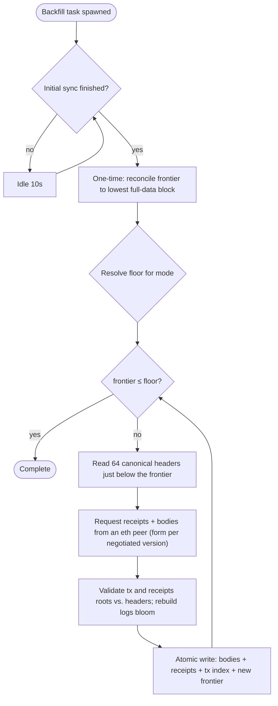

# Historical chain backfill

A snap-synced node backfills only block **headers** below the sync pivot; it does
not download the block bodies or receipts for pre-pivot blocks. As a result,
historical RPC queries for those blocks return empty:
`eth_getBlockByNumber`/`ByHash`, `eth_getBlockReceipts`,
`eth_getTransactionByHash`, and `eth_getTransactionReceipt` return `null`, and
`eth_getLogs` over a pre-pivot range fails.

Historical chain backfill is an **opt-in** background process that downloads and
validates the missing bodies and receipts after snap sync completes, so the node
can serve historical block, transaction, receipt, and log queries. It is off by
default, so a default node keeps its compact, headers-only footprint below the
pivot.

## Enabling it

| Flag | Env | Values | Default |
| --- | --- | --- | --- |
| `--history.chain` | `ETHREX_HISTORY_CHAIN` | `off`, `postmerge`, `all`, or a block number | `off` |
| `--history.transactions` | `ETHREX_HISTORY_TRANSACTIONS` | number of blocks (`0` = whole backfilled range) | `0` |

- **`off`** (default): headers-only below the pivot — current behavior.
- **`postmerge`**: backfill down to the network's merge (Paris) activation block.
  This is the recommended value: post-merge history is what the peer set reliably
  serves, and it is what most applications need.
- **`all`**: backfill as far back as receipts exist in a decodable form, i.e.
  down to the **Byzantium** block (mainnet `4,370,000`), not genesis. Before
  Byzantium (EIP-658) a receipt's first field is a post-state root rather than a
  status flag, a form ethrex does not represent, so those receipts can never be
  fetched. **Best-effort** — after the 2025 history expiry rollout many peers no
  longer serve pre-merge bodies/receipts, so this can stall at a block it cannot
  fetch (it reports the stall rather than failing the node).
- **a block number** (e.g. `22000000`): backfill down to exactly that block and
  stop there. Use this to keep a recent slice of history instead of the whole
  post-merge range — far less disk and far less time than `postmerge`, which on
  mainnet is ~10M blocks. A value between the merge and Byzantium blocks is
  honoured on the same best-effort basis as `all`; anything below Byzantium is
  clamped up to it, with a warning, for the reason given above.

`--history.transactions` controls how far back the transaction-lookup index
(`eth_getTransactionByHash`) is kept, independently of the block/receipt data,
mirroring geth's flag of the same name. `0` (the default) indexes the entire
backfilled range; a non-zero `N` indexes only blocks within `N` of the chain head
as it stood when the run started, and stores bodies/receipts for the rest without a
tx-hash index.

Two differences from geth's flag are worth knowing. It only governs what backfill
*writes*: nothing already indexed is ever un-indexed, and blocks above the sync
pivot are indexed unconditionally by normal block import, so an `N` smaller than
`head - pivot` has no effect on the range where the index is actually large. And
the window is pinned to the head at task start rather than tracking the live head,
so the boundary stays put over a run that can take weeks.

### Example

Run a node that serves post-merge history, keeping the transaction index for the
whole backfilled range:

```sh
ethrex \
  --authrpc.jwtsecret ./secrets/jwt.hex \
  --network mainnet \
  --history.chain postmerge
```

Backfill starts on its own once initial sync finishes — no restart or second
command is needed.

### Upgrading an existing node

**An already-synced node does not need to resync.** Add `--history.chain` and
restart: backfill starts from the history the node already has and fills
downward. There is no migration and no reindex — the feature writes to existing
column families and does not change the store schema version, so an existing
database opens unchanged.

On the first startup after the upgrade, a one-time reconciliation corrects
`earliest_block_number`, which on a node synced before this feature existed was
left at genesis. Without it, backfill would compare that stale value against the
floor and conclude there was nothing to do, so the correction runs *before* that
check:

```
INFO Historical chain backfill enabled mode=PostMerge horizon=0
INFO Reconciled backfill frontier to the lowest block with full chain data recorded=0 actual=25530850
DEBUG History backfill advanced
```

The reconciliation bisects the database for the lowest block with a contiguous
body (~25 reads on mainnet), which is the node's original snap pivot. A node that
full-synced from genesis reconciles to `0` and completes immediately, since it
already holds all history.

Note that the reconciliation only runs when backfill is enabled. An upgraded node
left at `--history.chain off` keeps the stale `earliest_block_number`, so the
`earliest` block tag still reports genesis even though pre-pivot bodies are
absent. Enabling backfill (or a fresh snap sync) sets it correctly.

## How it works

Backfill fills in reverse — from the pivot downward toward a floor — one bounded
batch (64 blocks) at a time. It runs at lower priority than following the chain
head: it waits until initial sync finishes, sleeps between batches, and never
lets the tip fall behind.


```mermaid
flowchart TD
    spawned([Backfill task spawned]) --> gate{"Initial sync finished?"}
    gate -- no --> wait["Idle 10s"] --> gate
    gate -- yes --> reconcile["One-time: reconcile frontier to lowest full-data block"]
    reconcile --> floor{"Resolve floor for mode"}
    floor --> done0{"frontier ≤ floor?"}
    done0 -- yes --> complete([Complete])
    done0 -- no --> read["Read 64 canonical headers just below the frontier"]
    read --> fetch["Request receipts + bodies from an eth peer (form per negotiated version)"]
    fetch --> validate["Validate tx and receipts roots vs. headers; rebuild logs bloom"]
    validate --> commit["Atomic write: bodies + receipts + tx index + new frontier"]
    commit --> done0
```

**Floor.** `postmerge` resolves the floor to the network's Paris activation
block — `merge_netsplit_block` when the chain config sets one, otherwise the
first proof-of-stake block found by difficulty bisection (block `15,537,394` on
mainnet). `all` uses the Byzantium block, and an explicit block number is used as
the floor directly. Every mode is clamped so the floor never falls below Byzantium.
If the chain never merged there is no post-merge segment, so `postmerge` keeps
idling until it does.

The floor is resolved once per run, not per batch, since neither the merge nor the
Byzantium block moves. Changing it therefore takes a restart: lowering it resumes
filling from wherever the frontier now sits, and raising it stops further filling
while keeping everything already stored. Backfill stops as soon as the frontier
reaches the floor, so a block number at or above the current frontier completes
with nothing to do.

**Frontier.** Progress is tracked in `earliest_block_number` (the lowest block
with full data). Each batch reads the canonical headers just below the frontier,
fetches their bodies and receipts, and — on success — lowers the frontier.

**Validation.** Bodies and receipts are validated against the already-synced
header chain (transactions root and receipts root) before being stored. A
receipt's logs bloom is recomputed from its logs, which reconstructs the bloom
that eth/69 onward omits, so backfill works with peers on any supported eth
version. The request form follows the version the connection negotiated: eth/68
and eth/69 take the original `GetReceipts`, while eth/70 (EIP-7975) replaced it
with a paginated form that eth/71 (EIP-8159, `requires: [7928, 7975]`) also uses.
When a paginated response ends in a partial block, that trailing block is dropped
and the response treated as a shorter prefix, so every stored block stays
root-verified.

Backfill throughput is bounded by how fast peers serve historical bodies and
receipts. After the 2025 history-expiry rollout only a subset of peers still
serve pre-merge/pre-pivot data, so on mainnet a full post-merge backfill runs on
the order of weeks.

## Durability and restarts

Backfill is crash-safe by construction: a node shutdown mid-backfill never
corrupts the database and always resumes exactly where it left off.

- **Each batch is one atomic write.** A batch's block bodies, receipts,
  transaction-index entries, **and** the updated frontier
  (`earliest_block_number`) are committed in a single RocksDB write batch. The
  frontier can never advance without its block data landing, or vice versa — so
  there is no ordering in which the on-disk state is left torn.
- **The frontier is the durable resume cursor.** On restart the task re-reads
  `earliest_block_number` and continues from there. The invariant *"every block in
  `[frontier, head]` has full bodies and receipts"* holds across any restart.
- **Worst case after an abrupt kill** (e.g. `docker restart -t 0`, power loss) is
  re-fetching the single most-recent batch: an un-fsynced write-ahead-log tail is
  discarded on RocksDB recovery, and because the frontier and its data share one
  atomic batch, they are lost together — never half-applied. A graceful shutdown
  fsyncs the database, so nothing is re-fetched.
- **Self-healing on startup.** A one-time reconciliation bisects the database for
  the true lowest full-data block and corrects `earliest_block_number` if it
  drifted — for example a node that snap-synced before this feature existed and
  left the value at genesis. This runs before filling resumes.

Because the only persistent effect of a batch is that atomic commit, the task is
simply dropped on shutdown rather than drained; there is nothing to clean up.

## Observing progress

Per-batch advances are logged at `debug` level, so at the default `info` level a
healthy backfill is quiet between the start and completion messages:

| Message | Level | When |
| --- | --- | --- |
| `Historical chain backfill enabled` | info | task starts |
| `Reconciled backfill frontier ...` | info | startup, only if the frontier drifted |
| `History backfill advanced` | debug | each batch |
| `Historical chain backfill complete` | info | frontier reaches the floor |
| `History backfill step failed (will retry)` | warn | a batch failed; it retries |

For continuous, log-level-independent visibility, enable metrics
(`--metrics`) and watch the `ethrex_db_backfill_frontier_block` gauge descend
toward the floor. See [DB observability](../../developers/l1/db-observability.md)
for the metric and its Grafana panel.

### Verifying it worked

Pick a post-merge block below your original sync pivot and confirm its body and
receipts are now present (replace the block number with one in your backfilled
range):

```sh
# Full block with transactions — returns the block instead of null once backfilled
curl -s http://localhost:8545 -H 'content-type: application/json' \
  -d '{"jsonrpc":"2.0","id":1,"method":"eth_getBlockByNumber","params":["0x1000000", true]}'

# Receipts for the same block
curl -s http://localhost:8545 -H 'content-type: application/json' \
  -d '{"jsonrpc":"2.0","id":1,"method":"eth_getBlockReceipts","params":["0x1000000"]}'
```

Before backfill reaches that height both return `null`/empty; afterward they
return the full block and its receipts.

## Limitations

- **Not an archive node.** Backfill restores historical *chain* data (blocks,
  transactions, receipts, logs); it does not restore historical *state*.
  `eth_call`, `eth_getBalance`, and tracing at old block heights remain bounded to
  the recent in-memory state window regardless of this setting.
- **`eth_getLogs` becomes correct, not fast.** Backfill lets historical log
  queries return results instead of failing, but there is no log/bloom index, so
  wide historical ranges are still served by a linear per-block bloom scan.
- **`all` is best-effort, and stops at Byzantium.** Pre-Byzantium receipts use the
  pre-EIP-658 post-state-root form, which ethrex cannot represent, so no mode
  descends below that block. Above it, many peers no longer serve pre-merge
  bodies/receipts, so `all` can stall at a block it cannot fetch; it reports the
  stall and keeps retrying rather than failing the node.
- **`--history.transactions` does not prune.** It bounds what backfill indexes, but
  never removes existing index entries, and blocks above the sync pivot are always
  indexed by normal import. Shrinking it on an already-indexed node frees nothing.

## Cost

Enabling backfill adds a substantial amount of disk usage, since it stores the
bodies and receipts a headers-only node omits. On mainnet the measured cost is
**~125 KiB per block** filled, at a rate of ~600 k blocks/day (~70 GiB/day), so
the full `postmerge` range needs on the order of **0.7–1.2 TB of history on top of
state**. See [Hardware requirements](../../getting-started/hardware_requirements.md#with-historical-chain-backfill-enabled)
for the current figures and recommended disk sizes (the `postmerge` numbers are
provisional while the reference run completes; `all` is not yet measured).

Because backfill walks from the pivot downward, the earliest blocks it fills are
the most recent and largest; per-block cost drops as it reaches older blocks, so
throughput in blocks/day rises over the course of a run.

The [DB observability](../../developers/l1/db-observability.md) dashboard breaks
this growth down per column family (`bodies`, `receipts_v2`,
`transaction_locations`). While filling, it uses spare network and CPU in the
background; it is rate-limited and yields to chain-head following, so it does not
slow down block processing.

State size is unaffected: backfill adds chain history only, and does not change
how much state the node keeps.

## References

- [Sync modes](./sync_modes.md) — full vs. snap sync and where backfill fits.
- [Snap sync internals](./snap_sync.md) — why a snap-synced node is headers-only below the pivot.
- [Databases](./databases.md) — store schema versioning.
- [DB observability](../../developers/l1/db-observability.md) — the backfill-frontier metric and dashboard.
- [CLI reference](../../CLI.md) — full flag documentation.
- geth's [`--history.chain` / `--history.transactions`](https://geth.ethereum.org/docs/fundamentals/command-line-options) flags, whose semantics this mirrors.
- [EIP-8159](https://eips.ethereum.org/EIPS/eip-8159) — the eth/71 receipts format backfill accepts.
