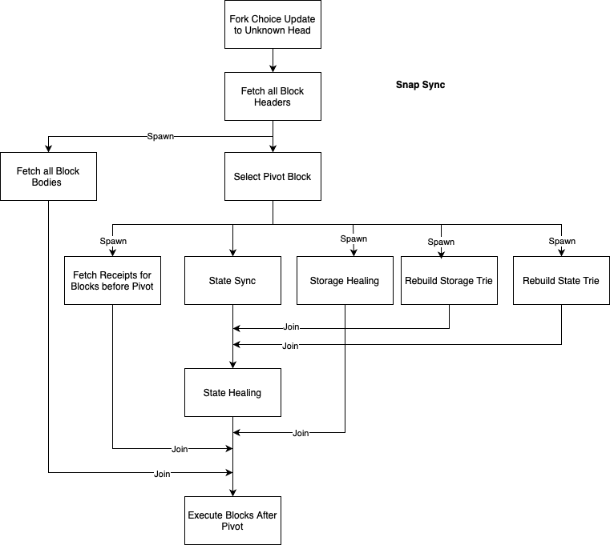
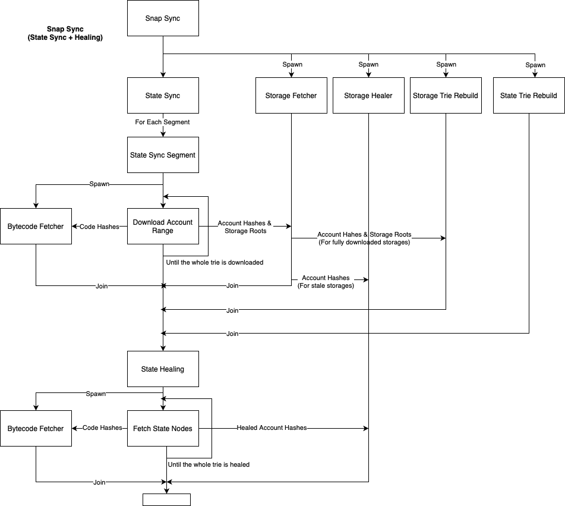

# Syncing

## Snap Sync

A snap sync cycle begins by fetching all the block headers (via eth p2p) between the current head (latest canonical block) and the sync head (block hash sent by a forkChoiceUpdate).

We will then fetch the block bodies from each header and at the same time select a pivot block (sync head - 64) and start rebuilding its state via snap p2p requests, if the pivot were to become stale during this rebuild we will select a newer pivot (sync head) and restart it.

After we fully rebuilt the pivot state and fetched all the block bodies we will fetch and store the receipts for the range between the current head and the pivot (including it), and at the same time store all blocks in the same range and execute all blocks after the pivot (like in full sync).

### Snap State Rebuild

During snap sync we need to fully rebuild the pivot block's state.
We can divide snap sync into 3 core processes: State Sync, Trie Rebuild, and Healing.
The State Sync consists of downloading the plain state of the pivot block, aka the values on the leafs of the state & storage tries. For this process we will divide the state trie into segments and fetch each segment in parallel. We will also be relying on two side processes, the `bytecode_fetcher` and the `storage_fetcher` which will both remain active throughout the state sync, and fetch the bytecodes and storages of each account downloaded during the state sync.
The Trie Rebuild process works in the background while State Sync is active. It consists of two processes running in parallel, one to rebuild the state trie and one to rebuild the storage tries. Both will read the data downloaded by the State Sync but while the state rebuild works independently, the storage rebuild will wait for the `storage_fetcher` to advertise which storages have been fully downloaded before attempting to rebuild them.
The Healing process consists of fixing any inconsistencies leftover from the State Sync & Trie Rebuild processes after they finish. As state sync can spawn across multiple cycles with different pivot blocks the state will not be consistent with the latest pivot block, so we need to fetch all the nodes that the pivot's tries have and ours don't. The `bytecode_fetcher` and `storage_healer` processes will be involved to heal the bytecodes & storages of each account healed by the main state heal process.
Also, the `storage_healer` will be spawned earlier, during state sync so that it can begin healing the storages that couldn't be fetched due to pivot staleness.

This diagram illustrates all the processes involved in snap sync:

.

And this diagram shows the interaction between the different processes involved in State Sync, Trie Rebuild and Healing:
.

To exemplify how queue-like processes work we will explain how the `bytecode_fetcher` works:

The `bytecode_fetcher` has its own channel where it receives code hashes from an active `rebuild_state_trie` process. Once a code hash is received, it is added to a pending queue. When the queue has enough messages for a full batch it will request a batch of bytecodes via snap p2p and store them. If a bytecode could not be fetched by the request (aka, we reached the response limit) it is added back to the pending queue. After the whole state is synced `fetch_snap_state` will send an empty list to the `bytecode_fetcher` to signal the end of the requests so it can request the last (incomplete) bytecode batch and end gracefully.

This diagram illustrates the process described above:

