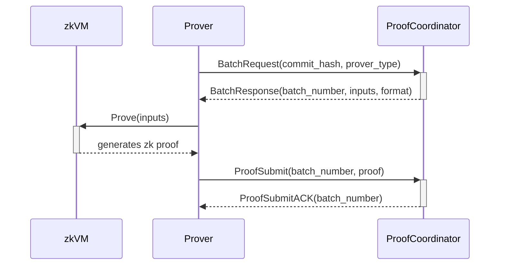

# ethrex-prover for L2

## Intro

The prover consists of two main components: handling incoming proving data from the L2 sequencer, specifically from the `ProofCoordinator` component, and the actual zkVM running and generating proofs of execution.

In summary, the prover manages the inputs from the `ProofCoordinator` and then calls the zkVM to perform the proving process and generate the zero-knowledge proof (groth16 for on-chain verification, or a compressed STARK for verification via Aligned Layer).

## Workflow

The `ProofCoordinator` monitors requests for new jobs from the `Prover`, which are sent when the prover is available. Upon receiving a new job, the Prover generates the proof, after which the `Prover` sends the proof back to the `ProofCoordinator`.

## Batch assignment protocol

When a prover sends a `BatchRequest`, the coordinator decides what to respond based on the following checks, evaluated in order:

1. **Prover type check**: is the prover's type (SP1, RISC0, Exec, TDX) in the set of proof types required by this deployment? If not, the coordinator responds with `ProverTypeNotNeeded`. This is a permanent rejection — the prover binary is incompatible with this coordinator's configuration.

2. **Resolve next batch**: the coordinator computes the next batch to prove as `1 + latest_sent_batch_proof` (the batch immediately after the last one whose proof was submitted to L1).

3. **Proof already exists**: does a proof from this prover type already exist for the batch? If so, the coordinator responds with an empty `BatchResponse` — there's nothing for this prover to do right now.

4. **Batch existence**: does the batch exist in the database?
   - If the batch **does not exist** and the prover's code version matches the coordinator's, the prover is simply ahead of the proposer. The coordinator responds with an empty `BatchResponse`.
   - If the batch **does not exist** and the versions **differ**, the prover is stale: future batches will be created with the coordinator's version. The coordinator responds with `VersionMismatch`.

5. **Version match**: the batch exists, so its public input must also exist (they are stored atomically). The coordinator looks up the input for the prover's code version. If not found, the batch was created with a different version — the coordinator responds with `VersionMismatch`.

6. **Happy path**: the batch exists, has no proof for this type yet, and has input matching the prover's version. The coordinator responds with a full `BatchResponse` containing the batch number, input data, and proof format.

### Prover-side handling

| Coordinator response | Prover action |
|---|---|
| `BatchResponse` (with data) | Prove the batch, submit the proof |
| `BatchResponse` (empty) | Sleep, retry later |
| `VersionMismatch` | Log version mismatch warning, sleep, retry later |
| `ProverTypeNotNeeded` | Log error, skip this coordinator, continue with others |

## References

For running the prover, see [Deploy an L2](../../l2/deployment/overview.md).
For developer-focused setup and run instructions, see [Running the Prover](../../developers/l2/prover.md).
For comprehensive details on the internals of the prover, see [ethrex-prover](../../prover/prover.md).
