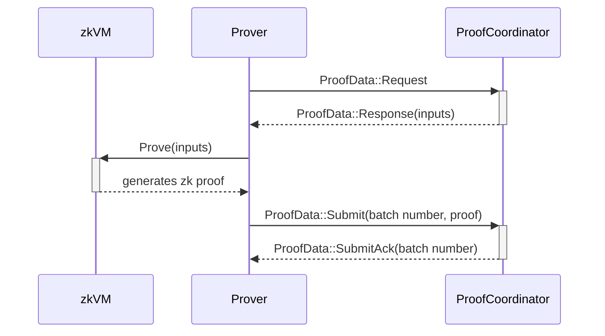

# ethrex-prover for L2

## Intro

The prover consists of two main components: handling incoming proving data from the L2 sequencer, specifically from the `ProofCoordinator` component, and the actual zkVM running and generating proofs of execution.

In summary, the prover manages the inputs from the `ProofCoordinator` and then calls the zkVM to perform the proving process and generate the zero-knowledge proof (groth16 for on-chain verification, or a compressed STARK for verification via Aligned Layer).

## Workflow

The `ProofCoordinator` monitors requests for new jobs from the `Prover`, which are sent when the prover is available. Upon receiving a new job, the Prover generates the proof, after which the `Prover` sends the proof back to the `ProofCoordinator`.

For running the prover, see [Deploy an L2](../../l2/deployment/overview.md).
For developer-focused setup and run instructions, see [Running the Prover](../../developers/l2/prover.md).
For comprehensive details on the internals of the prover, see [ethrex-prover](../../prover/prover.md).
