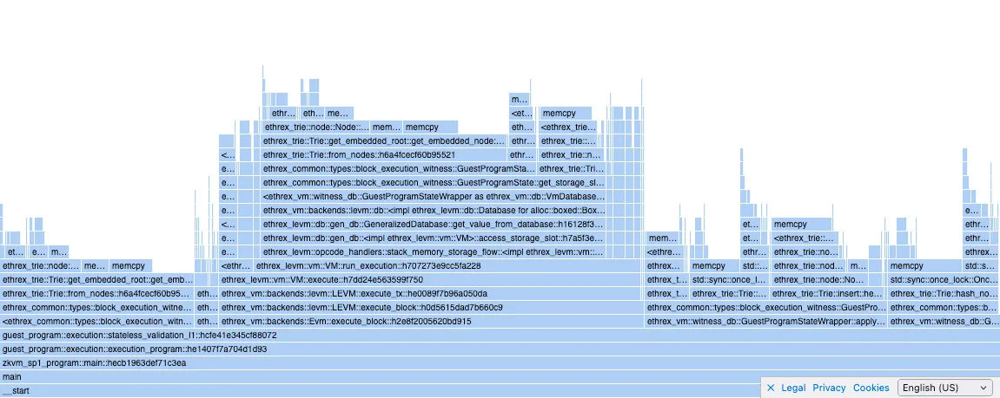
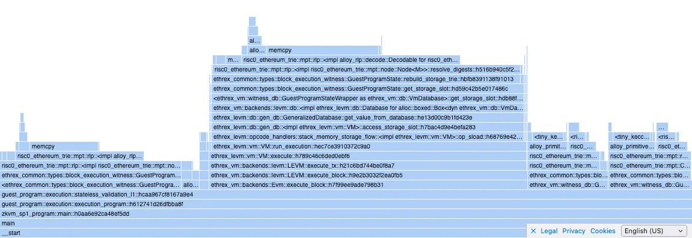
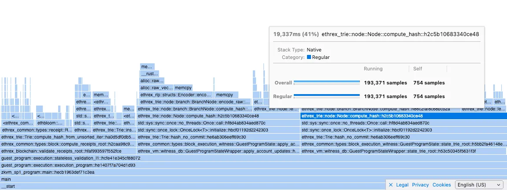
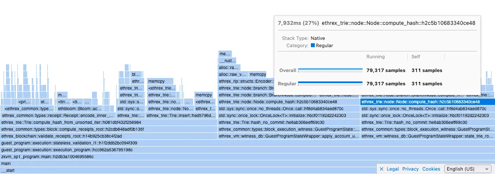
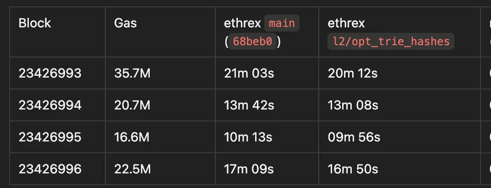
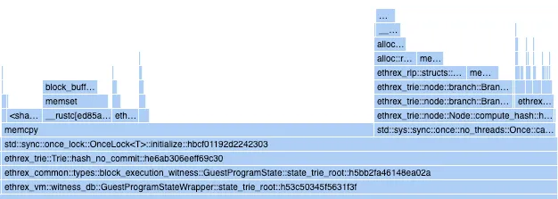
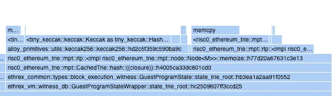

# ethrex-prover performance

## Latest benchmarks against rsp
- ethrex commit: `42073248334a6f517c22bd7b8faf30787724d9da` ([#5224](https://github.com/lambdaclass/ethrex/pull/5224/))
- rsp commit: `2c5718029e7c0b24a34b011088fef221489fc714`

| Block (mainnet) | Gas Used   | ethrex (SP1) | rsp     | (ethrex - rsp) / rsp * 100% |
| --------------- | ---------- | ------------ | ------- | --------------------------- |
| 23769082        | 7,949,562  | 02m 23s      | 01m 27s | 63.2%                       |
| 23769083        | 44,943,006 | 12m 24s      | 07m 49s | 58.7%                       |
| 23769084        | 27,075,543 | 08m 40s      | Failed  | -                           |
| 23769085        | 22,213,854 | 06m 40s      | Failed  | -                           |
| 23769086        | 28,364,699 | 07m 36s      | 04m 45s | 60.0%                       |
| 23769087        | 17,523,985 | 06m 02s      | Failed  | -                           |
| 23769088        | 17,527,759 | 04m 50s      | 02m 59s | 61.4%                       |
| 23769089        | 23,854,094 | 08m 14s      | 04m 44s | 73.9%                       |
| 23769090        | 24,238,029 | 08m 11s      | 04m 40s | 75.4%                       |
| 23769091        | 24,421,216 | 07m 02s      | Failed  | -                           |
| 23769092        | 21,714,227 | 06m 35s      | 04m 01s | 64.3%                       |

**Benchmark server hardware:**

For ethrex:
- AMD EPYC 7713 64-Core Processor
- 128 GB RAM
- RTX 4090 24 GB

For rsp:
- AMD EPYC 7F72 24-Core Processor
- 64 GB RAM
- RTX 4090 24 GB

> [!NOTE]  
> rsp exited with a `block gas used mismatch` error on the failed cases

**How to reproduce for ethrex:**
1. Clone [ethrex-replay](https://github.com/lambdaclass/ethrex-replay)
    1. Optionally, edit `Cargo.toml` to change the `ethrex` libraries to a specific branch/commit you want to benchmark.
    2. Run `cargo update` if you do change it.
3. Run `cargo r -r -F "sp1,gpu" -p ethrex-replay -- blocks --action prove --zkvm sp1 --from 23769082 --to 23769092 --rpc-url <RPC>`
    1. For ethrex, an RPC endpoint that implements `debug_executionWitness` (like an ethrex or reth node) works best.

**How to reproduce for rsp:**
1. Clone [rsp](https://github.com/succinctlabs/rsp)
  1. Make the following change so that we measure rsp's proving time the same way we measure it for ethrex (duration of the `prove()` call), you can then grep the stdout for `proving_time`:
```bash
        diff --git a/crates/executor/host/src/full_executor.rs b/crates/executor/host/src/full_executor.rs
    index 99a0478..d42a1d2 100644
    --- a/crates/executor/host/src/full_executor.rs
    +++ b/crates/executor/host/src/full_executor.rs
    @@ -123,6 +123,7 @@ pub trait BlockExecutor<C: ExecutorComponents> {
                 .map_err(|err| eyre::eyre!("{err}"))??;
    
                 let proving_duration = proving_start.elapsed();
    +            println!("proving time: {}", proving_duration.as_secs());
                 let proof_bytes = bincode::serialize(&proof.proof).unwrap();
    
                 hooks
```
3. Run `SP1_PROVER=cuda cargo r -r --manifest-path bin/host/Cargo.toml --block-number <BLOCK NUMBER> --rpc-url <RPC> --prove`
    1. For rsp, an alchemy RPC endpoint works best.

## Optimizations

| Name | PR | tl;dr |
| --- | --- | --- |
| jumpdest opt. | https://github.com/lambdaclass/ethrex/pull/4608 | Cuts 15% total zkvm cycles |
| trie opt. 1 | https://github.com/lambdaclass/ethrex/pull/4648 | Halves trie hashing calls |
| trie opt. 2 | https://github.com/lambdaclass/ethrex/pull/4723 | Trie hashing zkVM cycles reduced 1/4, faster than risc0-trie |
| trie opt. 3 | https://github.com/lambdaclass/ethrex/pull/4763 | Trie `get` and `insert` ops. reduced cycles by 1/14. |
| trie opt. 4 | https://github.com/lambdaclass/ethrex/pull/5224 | Serialize resolved tries and removes decoding, 22% total cycles reduced |
| ecpairing precompile  | https://github.com/lambdaclass/ethrex/pull/4809 | Reduced ecpairing cycles from 138k to 6k (10% total proving cycles gone) |
| ecmul precompile | https://github.com/lambdaclass/ethrex/pull/5133 | Reduces another 10% of total cycles |

Trie operations are one of the most expensive in our prover right now. We are using [risc0-trie](https://github.com/risc0/risc0-ethereum/tree/main/crates/trie) as a fast zkVM trie reference to optimize our own. [ethrex-trie optimization for zkvm](#ethrex-trie-optimization-for-zkvm) see for a detailed exploration of our trie vs risc0’s.

### Detailed proving times (SP1)

Benchmark server hardware:

- AMD EPYC 7713 64-Core Processor
- 128 GB RAM
- RTX 4090 24 GB

### Absolute times

| Block (Mainnet) | Gas | ethrex main (`70fc63`) | ethrex (jumpdest opt.) | ethrex (ecpairing precompile) | ethrex (trie opt1.) | ethrex (trie opt2.) | ethrex (trie opt3.) | ethrex (trie opt1. + trie opt2. + trie opt3.) | ethrex (all opts, our trie) | ethrex (risc0_trie) | rsp main (`9a7048`) |
| --- | --- | --- | --- | --- | --- | --- | --- | --- | --- | --- | --- |
| 23426993 | 35.7M | 20m 40s | 20m 04s | 20m 10s | 20m 12s | 19m 31s | 17m 20s | 16m 24s | 14m 38s | 14m 32s | 08m 39s |
| 23426994 | 20.7M | 13m 24s | 12m 55s | 12m 32s | 13m 08s | 12m 48s | 11m 31s | 10m 53s | 09m 18s | 10m 04s | 05m 39s |
| 23426995 | 16.6M | 10m 14s | 09m 54s | 09m 56s | 09m 56s | 09m 52s | 08m 39s | 08m 06s | 07m 20s | 07m 19s | 04m 33s |
| 23426996 | 22.5M | 16m 58s | 16m 37s | 15m 48s | 16m 50s | 15m 42s | 14m 44s | 14m 08s | 12m 25s | 12m 59s | 06m 39s |

### Relative improvement vs ethrex main (`(opt - base)/base * 100`)

| Block (Mainnet) | Gas | ethrex (jumpdest opt.) | ethrex (ecpairing precompile) | ethrex (trie opt1.) | ethrex (trie opt2.) | ethrex (trie opt3.) | ethrex (trie opt1+2+3) | ethrex (all opts, our trie) | ethrex (risc0_trie) |
| --- | --- | --- | --- | --- | --- | --- | --- | --- | --- |
| 23426993 | 35.7M | -2.9% | -2.4% | -2.3% | -5.6% | -16.1% | -20.6% | -29.2% | -29.7% |
| 23426994 | 20.7M | -3.6% | -6.5% | -2.0% | -4.5% | -14.1% | -18.8% | -30.6% | -24.9% |
| 23426995 | 16.6M | -3.3% | -2.9% | -2.9% | -3.6% | -15.5% | -20.8% | -28.3% | -28.5% |
| 23426996 | 22.5M | -2.1% | -6.9% | -0.8% | -7.5% | -13.2% | -16.7% | -26.8% | -23.5% |

### Relative to RSP main (`(opt - rsp) / rsp * 100`)

| Block | Gas | ethrex main | ethrex (jumpdest opt.) | ethrex (ecpairing precompile) | ethrex (trie opt1.) | ethrex (trie opt2.) | ethrex (trie opt3.) | ethrex (trie opt1+2+3) | ethrex (all opts, our trie) | ethrex (risc0_trie) |
| --- | --- | --- | --- | --- | --- | --- | --- | --- | --- | --- |
| 23426993 | 35.7M | 138.9% | 132.0% | 133.1% | 133.5% | 125.6% | 100.4% | 89.6% | 69.2% | 68.0% |
| 23426994 | 20.7M | 137.2% | 128.6% | 121.8% | 132.4% | 126.5% | 103.8% | 92.6% | 64.6% | 78.2% |
| 23426995 | 16.6M | 124.9% | 117.6% | 118.3% | 118.3% | 116.8% | 90.1% | 78.0% | 61.2% | 60.8% |
| 23426996 | 22.5M | 155.1% | 149.9% | 137.6% | 153.1% | 136.1% | 121.6% | 112.5% | 86.7% | 95.2% |

# ethrex-trie optimization for zkvm

# Overview

Using the risc0-trie we get the next perf. gains in cycle count over our ethrex-trie:

- `rebuild_storage_trie()` 218.999 -> 64.435 (x3.4)
- `rebuild_state_trie()` 119.510 -> 37.426 (x3.2)
- `apply_account_updates()` 139.519 -> 16.702 (x8.4)
- `state_trie_root()` 63.482 -> 17.276 (x3.7)
- `validate_receipts_root()` 13.068 -> 2.013 (x6.5)

our goal is to have our trie perform as close as possible to risc0’s.

# Flamegraph overview
ethrex-trie (filtering for `ethrex_trie` functions)



risc0-trie (filtering for `risc0_ethereum_trie` functions)


# Optimizations to our trie

## 1. Caching the initial node hashes

https://github.com/lambdaclass/ethrex/pull/4648

We were calculating all the hashes of the initial state trie (and storage) nodes, but we weren’t caching them when building the tries, so there was double hashing. https://github.com/lambdaclass/ethrex/pull/4648 fixes it by introducing a function to manually set the cached hash of a node, and caching whenever building a trie using `Trie::from_nodes` .

Calls to `compute_hash` were reduced by half after those changes:

before


after


although the total proving time didn’t change that much:



(proved with SP1 in `l2-gpu-3`, RTX 4090)

## 2. `memcpy` calls on trie hashing

ethrex-trie:


risc0-trie:


our `Node::compute_hash` is almost on par with risc0’s `Node::memoize` (hashes and caches the hash) but we have a big `memcpy` call that’s almost twice as long in cycles as the actual hashing.

initially I thought this was an overhead of `OnceLock::initialize` because risc0 uses an `Option` to cache the hash, but apparently that’s not the case as I ran a small experiment in which I compared initialization cycles for both and got the next results:

```bash
Report cycle tracker: {"oncelock": 3830000, "option": 3670000}
```

<details>
<summary>Experiment code</summary>

    lib

    ```rust
    use std::sync::OnceLock;

    pub struct OnceLockCache {
        pub inner: OnceLock<u128>,
    }

    impl OnceLockCache {
        pub fn init(&self, inner: u128) {
            println!("cycle-tracker-report-start: oncelock");
            self.inner.get_or_init(|| compute_inner(inner));
            println!("cycle-tracker-report-end: oncelock");
        }
    }

    pub struct OptionCache {
        pub inner: Option<u128>,
    }

    impl OptionCache {
        pub fn init(&mut self, inner: u128) {
            println!("cycle-tracker-report-start: option");
            self.inner = Some(compute_inner(inner));
            println!("cycle-tracker-report-end: option");
        }
    }

    pub fn compute_inner(inner: u128) -> u128 {
        inner.pow(2)
    }
    ```

    guest program

    ```rust
    #![no_main]
    sp1_zkvm::entrypoint!(main);

    use std::sync::OnceLock;

    use fibonacci_lib::{OnceLockCache, OptionCache};

    pub fn main() {
        let mut oncelocks = Vec::with_capacity(10000);
        let mut options = Vec::with_capacity(10000);

        for i in (1 << 64)..((1 << 64) + 10000) {
            let oncelock_cache = OnceLockCache {
                inner: OnceLock::new(),
            };
            oncelock_cache.init(i);
            oncelocks.push(oncelock_cache);
        }

        for i in (1 << 64)..((1 << 64) + 10000) {
            let mut option_cache = OptionCache { inner: None };
            option_cache.init(i);
            options.push(option_cache);
        }
    }
    ```

</details>

in the flamegraph it’s not clear where that `memcpy` is originating (any ideas?). The calls that are on top of it are `encode_bytes()` (from our RLP lib) and some `sha3` calls.

> Node hashing is composed of two operations: first the node is encoded into RLP, then we keccak hash the result.
>

### RLP Encoding

Our RLP lib uses a temp buffer to write encoded payloads to, and in the end it `finalize`s the encoding by writing the payload prefix (which contains a length) to an output buffer, plus the actual payload. This means we are allocating two buffers, initializing them, and copying bytes to both of them for each node that’s being encoded and hashed.

First I tried preallocating the buffers (which are vecs) by estimating a node’s final RLP length.

This was done in the `l2/opt_rlp_buffer`, this had an influence the `memcpy` length by reducing it almost 15%:

then I tried to bypass our RLP encoder altogether by implementing a small and fast encoding for the `Branch` node only (which is the majoritarian node type), this reduced `memcpy`  further, 30% over `main`:

I didn’t test implementing fast RLP for the other node types as I was expecting a bigger reduction in `memcpy` from `Branch` alone.

### Keccak

A difference between our trie and risc0’s is that they use the `tiny-keccak` crate instead of `sha3` as we do. I tried replacing it in our trie but the `memcpy` got bigger.

Regarding memory, I also noticed that when hashing we are initializing a 32 byte array and writing the hash to it after. I wanted to test if this mattered so I experimented by creating an uninitialized buffer with `MaybeUninit` (unsafe rust) and writing the hash to it. This had no impact in `memcpy`'s length.

Both changes are in the `l2/opt_keccak` branch.

### Final

At the end the problem was a combination of slow RLP encoding and that we did a preorder traversal while hashing a trie recursively. This was fixed in https://github.com/lambdaclass/ethrex/pull/4723.

## 3. Node cloning in `NodeRef::get_node`

Whenever we `get`, `insert` or `remove` from a trie we are calling `NodeRef::get_node` which clones the `Node` from memory and returns it, which means that for each operation over a trie we are cloning all the relevant nodes for that op.

This is fixed in https://github.com/lambdaclass/ethrex/pull/4763 see that PR desc. for details
