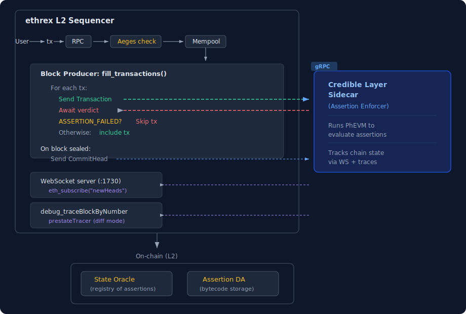

# Credible Layer Integration

## Overview

ethrex L2 integrates with the [Credible Layer](https://docs.phylax.systems/credible/credible-introduction) — a pre-execution security infrastructure by Phylax Systems that validates transactions against on-chain assertions before block inclusion. Transactions that violate an assertion are silently dropped before they land on-chain.

### Architecture



### Key Concepts

- **Assertion**: A Solidity contract that defines a security invariant (e.g., "ownership of contract X must not change"). Written using the [`credible-std`](https://github.com/phylaxsystems/credible-std) library.
- **Assertion Enforcer (Sidecar)**: A separate process that receives candidate transactions from the block builder, simulates them, runs applicable assertions through the PhEVM, and returns pass/fail verdicts.
- **State Oracle**: An on-chain contract that maps protected contracts to their assertions.
- **Permissive on failure**: If the sidecar is unreachable or times out, transactions are included anyway. Liveness is prioritized over safety.

### Communication Protocol

ethrex communicates with the sidecar via **gRPC** using the protocol defined in [`sidecar.proto`](../../crates/l2/proto/sidecar.proto):

| RPC | Type | Purpose |
|-----|------|---------|
| `StreamEvents` | Bidirectional stream | Send block lifecycle events (CommitHead, NewIteration, Transaction) |
| `SubscribeResults` | Server stream | Receive transaction verdicts as they complete |
| `GetTransaction` | Unary | Poll for a single transaction result |

> **Note:** `SubscribeResults` is not yet consumed by ethrex. Transaction verdicts are currently obtained by polling `GetTransaction`. A future improvement should subscribe to `SubscribeResults` as the primary mechanism and use `GetTransaction` only as a fallback.

### Block Building Flow

Per block:

1. **CommitHead** → sidecar (previous block finalized, with block hash and tx count)
2. **NewIteration** → sidecar (new block env: number, timestamp, coinbase, gas limit, basefee)
3. For each candidate transaction:
   - **Transaction** → sidecar (pre-execution: tx data sent via StreamEvents)
   - Execute the transaction in the local EVM
   - ← **GetTransaction** poll (post-execution: fetch the sidecar's verdict)
   - If `ASSERTION_FAILED`: undo execution and drop the transaction
   - Otherwise: keep it in the block

Privileged transactions (L1→L2 deposits) bypass the Credible Layer in this first version of the integration.

---

## Implementation Details

### Key Files

| File | Role |
|------|------|
| `crates/l2/sequencer/credible_layer/mod.rs` | Module root, proto imports |
| `crates/l2/sequencer/credible_layer/client.rs` | `CredibleLayerClient` — GenServer actor wrapping the gRPC sidecar client (StreamEvents, GetTransaction) |
| `crates/l2/sequencer/credible_layer/errors.rs` | Error types |
| `crates/l2/proto/sidecar.proto` | Sidecar gRPC protocol definition |
| `crates/l2/sequencer/block_producer.rs` | Block producer — sends CommitHead + NewIteration |
| `crates/l2/sequencer/block_producer/payload_builder.rs` | Transaction selection — sends Transaction events |

### Configuration

CLI flags:

| Flag | Description | Default |
|------|-------------|---------|
| `--credible-layer-url` | gRPC endpoint for the sidecar. Passing this flag enables the integration. | (none) |

When `--credible-layer-url` is not set, Credible Layer is completely disabled with zero overhead.

### Sidecar Requirements

The sidecar connects to ethrex L2 and needs:

| Endpoint | What it does |
|----------|--------------|
| HTTP RPC (`:1729`) | `eth_blockNumber`, `eth_getBlockByNumber`, `debug_traceBlockByNumber` |
| WebSocket (`:1730`) | `eth_subscribe("newHeads")` for live block tracking |

The `debug_traceBlockByNumber` with `prestateTracer` in diff mode is particularly important — the sidecar uses it to build its local state database.

---

## How to Run (End-to-End)

This is a step-by-step guide to run the full Credible Layer stack locally, deploy an assertion, and verify that violating transactions are dropped. All steps have been tested and verified.

### Prerequisites

- [Foundry](https://book.getfoundry.sh/getting-started/installation) (`forge`)
- Docker (running)
- Node.js >= 22 and `pnpm` (for the assertion indexer)
- ethrex built (including contract compilation):
  ```bash
  COMPILE_CONTRACTS=true cargo build --release -p ethrex --features l2
  ```

### Step 1: Start ethrex L1

```bash
cd crates/l2
rm -rf dev_ethrex_l1 dev_ethrex_l2

../../target/release/ethrex \
  --network ../../fixtures/genesis/l1.json \
  --http.port 8545 --http.addr 0.0.0.0 \
  --authrpc.port 8551 --dev \
  --datadir dev_ethrex_l1 &

# Verify (wait ~10s — initial "payload_id is None" errors are normal and resolve themselves)
sleep 10
rex block-number --rpc-url http://localhost:8545
```

> **Note:** You may see `ERROR Failed to produce block: payload_id is None in ForkChoiceResponse` in the first few seconds. This is a known L1 dev mode timing issue — the engine API needs a moment to initialize. The errors stop after a few blocks and block production continues normally.

### Step 2: Deploy L2 contracts on L1

```bash
../../target/release/ethrex l2 deploy \
  --eth-rpc-url http://localhost:8545 \
  --private-key 0x385c546456b6a603a1cfcaa9ec9494ba4832da08dd6bcf4de9a71e4a01b74924 \
  --on-chain-proposer-owner 0x4417092b70a3e5f10dc504d0947dd256b965fc62 \
  --bridge-owner 0x4417092b70a3e5f10dc504d0947dd256b965fc62 \
  --bridge-owner-pk 0x941e103320615d394a55708be13e45994c7d93b932b064dbcb2b511fe3254e2e \
  --deposit-rich \
  --private-keys-file-path ../../fixtures/keys/private_keys_l1.txt \
  --genesis-l1-path ../../fixtures/genesis/l1.json \
  --genesis-l2-path ../../fixtures/genesis/l2.json
```

This uses the pre-built binary directly (no recompilation). Addresses are written to `cmd/.env`.

### Step 3: Start ethrex L2 with Credible Layer

```bash
export $(cat ../../cmd/.env | xargs)

RUST_LOG=info ../../target/release/ethrex l2 \
  --no-monitor \
  --watcher.block-delay 0 \
  --network ../../fixtures/genesis/l2.json \
  --http.port 1729 --http.addr 0.0.0.0 \
  --datadir dev_ethrex_l2 \
  --l1.bridge-address $ETHREX_WATCHER_BRIDGE_ADDRESS \
  --l1.on-chain-proposer-address $ETHREX_COMMITTER_ON_CHAIN_PROPOSER_ADDRESS \
  --eth.rpc-url http://localhost:8545 \
  --block-producer.coinbase-address 0x0007a881CD95B1484fca47615B64803dad620C8d \
  --committer.l1-private-key 0x385c546456b6a603a1cfcaa9ec9494ba4832da08dd6bcf4de9a71e4a01b74924 \
  --proof-coordinator.l1-private-key 0x39725efee3fb28614de3bacaffe4cc4bd8c436257e2c8bb887c4b5c4be45e76d \
  --credible-layer-url http://localhost:50051 \
  --ws.enabled --ws.port 1730 &

# Verify (wait ~10s for L2 to start)
rex block-number --rpc-url http://localhost:1729
```

The L2 will log `StreamEvents connect failed, retrying in 5s` until the sidecar starts. This is expected — the L2 is permissive and keeps producing blocks.

### Step 4: Deploy the State Oracle on L2

The DA prover address must match the private key used by assertion-da (`0xdd7e619d...` → `0xb0d60c09103F4a5c04EE8537A22ECD6a34382B36`).

```bash
git clone https://github.com/phylaxsystems/credible-layer-contracts /tmp/credible-layer-contracts
cd /tmp/credible-layer-contracts
forge install

PK=0xbcdf20249abf0ed6d944c0288fad489e33f66b3960d9e6229c1cd214ed3bbe31

STATE_ORACLE_MAX_ASSERTIONS_PER_AA=100 \
STATE_ORACLE_ASSERTION_TIMELOCK_BLOCKS=1 \
STATE_ORACLE_ADMIN_ADDRESS=$(rex address --private-key $PK) \
DA_PROVER_ADDRESS=0xb0d60c09103F4a5c04EE8537A22ECD6a34382B36 \
DEPLOY_ADMIN_VERIFIER_OWNER=true \
DEPLOY_ADMIN_VERIFIER_WHITELIST=false \
ADMIN_VERIFIER_WHITELIST_ADMIN_ADDRESS=0x0000000000000000000000000000000000000001 \
forge script script/DeployCore.s.sol:DeployCore \
  --rpc-url http://localhost:1729 \
  --private-key $PK \
  --broadcast
```

Note the addresses from the output (these are deterministic with CREATE2):

| Contract | Address |
|----------|---------|
| DA Verifier (ECDSA) | `0x422A3492e218383753D8006C7Bfa97815B44373F` |
| Admin Verifier (Owner) | `0x9f9F5Fd89ad648f2C000C954d8d9C87743243eC5` |
| **State Oracle Proxy** | `0x72ae2643518179cF01bcA3278a37ceAD408DE8b2` |

### Step 5: Start assertion DA

The assertion DA stores assertion bytecode. It must be running before uploading assertions (step 6) and before the sidecar starts (step 7).

```bash
docker run -d --name assertion-da -p 5001:5001 \
  -e DB_PATH=/data/assertions \
  -e DA_LISTEN_ADDR=0.0.0.0:5001 \
  -e DA_CACHE_SIZE=1000000 \
  -e DA_PRIVATE_KEY=0xdd7e619d26d7eef795e3b5144307204f2f5d7d08298d04b926e874c6d9d43e75 \
  -v /var/run/docker.sock:/var/run/docker.sock \
  ghcr.io/phylaxsystems/credible-sdk/assertion-da-dev:sha-01b3374
```

### Step 6: Deploy OwnableTarget test contract

```bash
PK=0xbcdf20249abf0ed6d944c0288fad489e33f66b3960d9e6229c1cd214ed3bbe31

rex deploy \
  --contract-path <ethrex_repo>/crates/l2/contracts/src/credible_layer/OwnableTarget.sol \
  --private-key $PK --rpc-url http://localhost:1729 --print-address --remappings ""
```

Note the contract address from the output. Example: `0x00c042c4d5d913277ce16611a2ce6e9003554ad5`

### Step 7: Upload assertion to DA and register on State Oracle

Build the assertion using the [credible-layer-starter](https://github.com/phylaxsystems/credible-layer-starter) repo:

```bash
git clone --recurse-submodules https://github.com/phylaxsystems/credible-layer-starter /tmp/credible-layer-starter
cd /tmp/credible-layer-starter
pcl build   # or: forge build
```

Submit the assertion's **creation bytecode** to the DA server:

```bash
CREATION_BYTECODE=$(cat out/OwnableAssertion.a.sol/OwnableAssertion.json | \
  python3 -c "import sys,json; print(json.load(sys.stdin)['bytecode']['object'])")

curl -s http://localhost:5001 -X POST -H "Content-Type: application/json" \
  -d "{\"jsonrpc\":\"2.0\",\"method\":\"da_submit_assertion\",\"params\":[\"$CREATION_BYTECODE\"],\"id\":1}"
```

Note the `id` from the response — that's the **assertion ID**. Then get the prover signature:

```bash
ASSERTION_ID=<id from above>

DA_SIG=$(curl -s http://localhost:5001 -X POST -H "Content-Type: application/json" \
  -d "{\"jsonrpc\":\"2.0\",\"method\":\"da_get_assertion\",\"params\":[\"$ASSERTION_ID\"],\"id\":1}" | \
  python3 -c "import sys,json; print(json.load(sys.stdin)['result']['prover_signature'])")
```

Now register the assertion on the State Oracle:

```bash
PK=0xbcdf20249abf0ed6d944c0288fad489e33f66b3960d9e6229c1cd214ed3bbe31
STATE_ORACLE=0x72ae2643518179cF01bcA3278a37ceAD408DE8b2
OWNABLE_TARGET=<address from step 6>
ADMIN_VERIFIER=0x9f9F5Fd89ad648f2C000C954d8d9C87743243eC5
DA_VERIFIER=0x422A3492e218383753D8006C7Bfa97815B44373F

# Disable whitelist (required for devnet)
rex send $STATE_ORACLE "disableWhitelist()" \
  -k $PK --rpc-url http://localhost:1729

# Register the target contract as an assertion adopter
rex send $STATE_ORACLE "registerAssertionAdopter(address,address,bytes)" \
  $OWNABLE_TARGET $ADMIN_VERIFIER "0x" \
  -k $PK --rpc-url http://localhost:1729

# Add the assertion
rex send $STATE_ORACLE "addAssertion(address,bytes32,address,bytes,bytes)" \
  $OWNABLE_TARGET $ASSERTION_ID $DA_VERIFIER "0x" $DA_SIG \
  -k $PK --rpc-url http://localhost:1729

# Verify
rex call $STATE_ORACLE "hasAssertion(address,bytes32)" \
  $OWNABLE_TARGET $ASSERTION_ID --rpc-url http://localhost:1729
# Should return: 0x0000000000000000000000000000000000000000000000000000000000000001 (true)
```

### Step 8: Start the assertion indexer and sidecar

The sidecar discovers assertions through a GraphQL indexer that watches State Oracle events.

Clone and start the [sidecar-indexer](https://github.com/phylaxsystems/sidecar-indexer):

```bash
git clone https://github.com/phylaxsystems/sidecar-indexer /tmp/sidecar-indexer
cd /tmp/sidecar-indexer

cat > .env << EOF
RPC_ENDPOINT=http://host.docker.internal:1729
STATE_ORACLE_ADDRESS=0x72ae2643518179cF01bcA3278a37ceAD408DE8b2
STATE_ORACLE_DEPLOYMENT_BLOCK=0
FINALITY_CONFIRMATION=1
GRAPHQL_SERVER_PORT=4350
DB_HOST=db
DB_PORT=5432
DB_NAME=squid
DB_USER=postgres
DB_PASS=postgres
EOF

docker compose -f infra/local/docker-compose.yaml up --build -d
```

Wait ~15 seconds, then verify the indexer found the assertion:

```bash
curl -s http://localhost:4350/graphql -X POST -H "Content-Type: application/json" \
  -d '{"query":"{ assertionAddeds { totalCount nodes { assertionId assertionAdopter } } }"}'
# Should show totalCount: 1
```

Create `sidecar-config.json`:

```json
{
  "chain": { "spec_id": "CANCUN", "chain_id": 65536999 },
  "credible": {
    "assertion_gas_limit": 3000000,
    "cache_capacity_bytes": 256000000,
    "flush_every_ms": 5000,
    "assertion_da_rpc_url": "http://host.docker.internal:5001",
    "event_source_url": "http://host.docker.internal:4350/graphql",
    "poll_interval": 1000,
    "assertion_store_db_path": "/tmp/sidecar/assertion_store_database",
    "transaction_observer_db_path": "/tmp/sidecar/transaction_observer_database",
    "transaction_observer_endpoint": null,
    "transaction_observer_auth_token": "",
    "state_oracle": "0x72ae2643518179cF01bcA3278a37ceAD408DE8b2",
    "state_oracle_deployment_block": 0,
    "transaction_results_max_capacity": 1000,
    "accepted_txs_ttl_ms": 600000,
    "assertion_store_prune_config_interval_ms": 60000,
    "assertion_store_prune_config_retention_blocks": 0
  },
  "transport": { "bind_addr": "0.0.0.0:50051", "health_bind_addr": "0.0.0.0:9547" },
  "state": {
    "sources": [{
      "type": "eth-rpc",
      "ws_url": "ws://host.docker.internal:1730",
      "http_url": "http://host.docker.internal:1729"
    }],
    "minimum_state_diff": 100,
    "sources_sync_timeout_ms": 1000,
    "sources_monitoring_period_ms": 500
  }
}
```

**Important:** `chain_id` must match your L2 genesis chain ID (`65536999` for the default ethrex L2 genesis).

Pull the sidecar Docker image and start it:

```bash
docker pull ghcr.io/phylaxsystems/credible-sdk/sidecar:main

docker run -d --name credible-sidecar \
  -p 50051:50051 -p 9547:9547 \
  -e RUST_LOG=info,sidecar::engine=debug \
  -v $(pwd)/sidecar-config.json:/etc/credible-sidecar/config.json:ro \
  ghcr.io/phylaxsystems/credible-sdk/sidecar:main \
  --config-file-path /etc/credible-sidecar/config.json
```

Wait ~15 seconds, then verify the sidecar is healthy and loaded the assertion:

```bash
curl http://localhost:9547/health  # Should return "OK"

# Check logs for assertion loading (wait ~15s after start)
docker logs credible-sidecar 2>&1 | sed 's/\x1b\[[0-9;]*m//g' | grep "trigger_recorder"
# Should show: triggers: {Call { trigger_selector: 0xf2fde38b }: {0x7ab4397a}}
# This means: transferOwnership(address) calls will trigger the assertion
```

### Step 9: Test — violating transaction is DROPPED

Send a `transferOwnership` call. The sidecar detects the assertion violation and ethrex drops the transaction:

```bash
PK=0xbcdf20249abf0ed6d944c0288fad489e33f66b3960d9e6229c1cd214ed3bbe31
OWNABLE_TARGET=<address from step 6>

# Check current owner
rex call $OWNABLE_TARGET "owner()" --rpc-url http://localhost:1729

# Try to transfer ownership (this should time out — tx never included!)
timeout 25 rex send $OWNABLE_TARGET "transferOwnership(address)" \
  0x0000000000000000000000000000000000000001 \
  -k $PK --rpc-url http://localhost:1729
# Expected: times out with no output (tx was dropped by Credible Layer)

# Verify owner is UNCHANGED
rex call $OWNABLE_TARGET "owner()" --rpc-url http://localhost:1729
# Should still be the original deployer address
```

Check sidecar logs to confirm the assertion caught it:

```bash
# Note: docker logs contain ANSI color codes, so pipe through sed to strip them
docker logs credible-sidecar 2>&1 | sed 's/\x1b\[[0-9;]*m//g' | grep "is_valid=false"
# Should show: Transaction processed ... is_valid=false
docker logs credible-sidecar 2>&1 | sed 's/\x1b\[[0-9;]*m//g' | grep "assertion_failure"
# Should show: Transaction failed assertion validation ... failed_assertions=[...]
```

### Step 10: Test — valid transaction is INCLUDED

Send a non-protected call (`doSomething()`). The sidecar allows it through:

```bash
rex send $OWNABLE_TARGET "doSomething()" \
  -k $PK --rpc-url http://localhost:1729
# Expected: status 1 (success), included in a block
```

Check sidecar logs:

```bash
docker logs credible-sidecar 2>&1 | sed 's/\x1b\[[0-9;]*m//g' | grep "is_valid=true"
# Should show: Transaction processed ... is_valid=true
```

### Cleanup

Stop all services and remove containers and data:

```bash
# Stop ethrex L1 and L2
pkill -f ethrex

# Remove Docker containers
docker rm -f credible-sidecar assertion-da

# Stop and remove indexer (PostgreSQL + indexer + API)
cd /tmp/sidecar-indexer && docker compose -f infra/local/docker-compose.yaml down -v

# Remove ethrex data directories
cd <ethrex_repo>/crates/l2
rm -rf dev_ethrex_l1 dev_ethrex_l2

# (Optional) Remove cloned repos
rm -rf /tmp/credible-layer-contracts /tmp/credible-layer-starter /tmp/sidecar-indexer /tmp/cb_compiled
```

---

## References

- [Credible Layer Introduction](https://docs.phylax.systems/credible/credible-introduction)
- [Architecture Overview](https://docs.phylax.systems/credible/architecture-overview)
- [Assertion Enforcer](https://docs.phylax.systems/credible/assertion-enforcer)
- [Network Integration](https://docs.phylax.systems/credible/network-integration)
- [Linea/Besu Integration](https://docs.phylax.systems/credible/network-integrations/architecture-linea)
- [credible-std Library](https://github.com/phylaxsystems/credible-std)
- [Besu Plugin Reference](https://github.com/phylaxsystems/credible-layer-besu-plugin)
- [sidecar.proto](../../crates/l2/proto/sidecar.proto)
