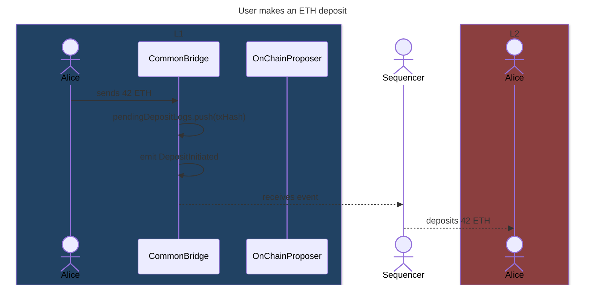

# Deposits

This document contains a detailed explanation of how asset deposits work.

## Native ETH deposits

This section explains step by step how native ETH deposits work.

On L1:

1. The user sends ETH to the `CommonBridge` contract.
2. The bridge adds the hash of the deposit to the `pendingDepositLogs`.
3. The bridge emits a `DepositInitiated` event:

    ```solidity
    emit DepositInitiated(
        msg.value,   // amount
        msg.sender,  // to
        depositId,
        msg.sender,  // recipient of the deposit
        msg.sender,  // sender in L2
        21000 * 5,   // gas limit
        "",          // calldata
        l2MintTxHash
    );
    ```

Off-chain:

1. The L1 watcher on each node processes `DepositInitiated` events, each adding a `PrivilegedL2Transaction` to the L2 mempool.
2. The privileged transaction is treated similarly to an EIP-1559 transaction, but with the following changes:
   1. They don't have sender signatures. Those are validated in the L1, since the sender of the L1 deposit transaction is the sender in the L2.
      As a consequence of this, privileged transactions can also be sent from L1 contracts.
   2. At the start of the execution, the `recipient` account balance is increased by the transaction's value. The transaction's value is set to zero during the rest of the execution.
   3. The sender account's nonce isn't increased as a result of the execution.
   4. The sender isn't charged for the gas costs of the execution.

On L2:

1. The privileged transaction increases the account balance of the recipient by the deposit amount.
2. Additionally, a call to the sender address is executed, which immediately halts in case the sender is an EOA.

<!-- TODO: what happens if the call reverts? -->

Back on L1:

1. A sequencer commits a batch on L1 including the privileged transaction.
2. The `OnChainProposer` notifies the bridge of the consumed privileged transactions.
3. The bridge removes them from `pendingDepositLogs`, asserting the included privileged transactions exist and are included in order.
<!-- TODO: do we require privileged transactions to be included in order inside each batch? -->



## ERC20 deposits through the native bridge

This section explains step by step how native ERC20 deposits work.

On L1:

1. The user gives the `CommonBridge` allowance via an `approve` call to the L1 token contract.
2. The user calls `depositERC20` on the bridge, specifying the L1 and L2 token addresses, the amount to deposit, along with the intended L2 recipient.
3. The bridge locks the specified L1 token amount in the bridge, updating the mapping with the amount locked for the L1 and L2 token pair. This ensures that L2 token withdrawals don't consume L1 tokens that weren't deposited into that L2 token.
   - TODO: we should consider moving this book-keeping logic to the L2 bridge.
4. The bridge emits a `DepositInitiated` event:

    ```solidity
    emit DepositInitiated(
        0,            // amount (unused)
        0xffff,       // to (the L2 bridge)
        depositId,
        0,            // recipient of the ETH deposit (unused)
        0xffff,       // sender in L2 (the L2 bridge)
        gasLimit,     // gas limit
        data,         // calldata
        l2MintTxHash
    );
    ```

On L2:

1. The privileged transaction performs a call to `mintERC20` on the `L2CommonBridge` from the L2 bridge's address, specifying the address of the L1 and L2 tokens, along with the amount and recipient.
2. The bridge calls `mint` on the L2 token, minting the specified amount of tokens and sending them to the L2 recipient.
3. If the call reverts, the L2 bridge automatically initiates a withdrawal.

Back on L1:

1. A sequencer commits a batch on L1 including the privileged transaction.
2. The `OnChainProposer` notifies the bridge of the consumed privileged transactions.
3. The bridge removes them from `pendingDepositLogs`, asserting the included privileged transactions exist and are included in order.
<!-- TODO: do we require privileged transactions to be included in order inside each batch? -->

<!-- TODO: add diagram -->
