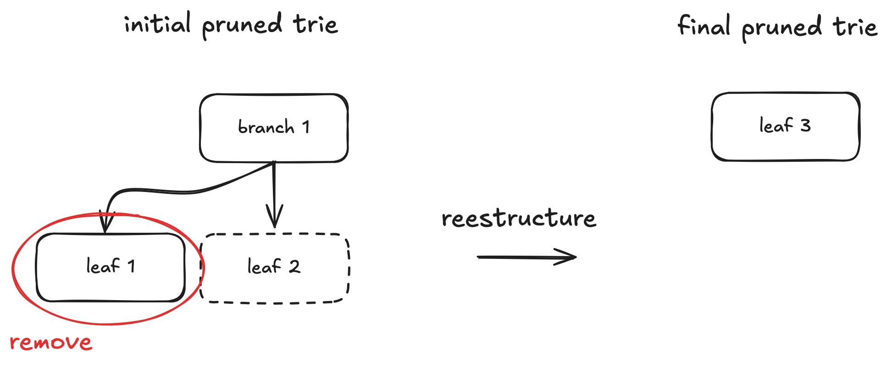
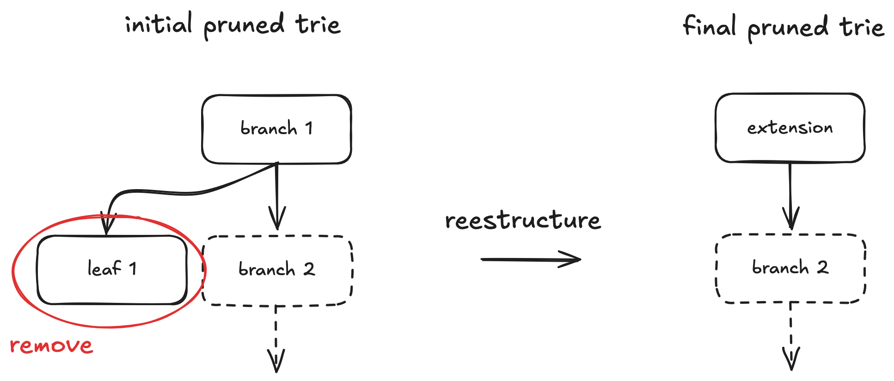

# Execution witness

The purpose of the execution witness is to allow executing blocks without having access to the whole Ethereum state, as it wouldn't fit in a zkVM program. It contains only the state values needed during the execution.

An execution witness contains all the initial state values (state nodes, codes, storage keys, block headers) that will be read or written to during the blocks' execution.

An execution witness is created from a prior execution of the blocks. This execution can be done by a synced node, and it would expose the data to a RPC endpoint. This is the `debug_executionWitness` endpoint which is implemented by ethrex and other clients.

If this endpoint is not available, the prover needs to do the following:

1. execute the blocks (also called "pre-execution") to identify which state values will be accessed.
2. log every initial state value accessed or updated during this execution.
3. retrieve an MPT proof for each value, linking it (or its non-existence) to the initial state root hash, using the `eth_getProof` RPC endpoint of a synced node.

Steps 1 and 2 are data collection steps only - no validation is performed at this stage. The actual validation happens later inside the zkVM guest program. Step 3 involves more complex logic due to potential issues when restructuring the pruned state trie after value removals. In sections [initial state validation](../../prover/guest_program.md#step-1-initial-state-validation) and [final state validation](../../prover/guest_program.md#step-3-final-state-validation) we explain what are pruned tries and in which case they get restructured.

If a value is removed during block execution (meaning it existed initially but not finally), two pathological cases can occur where the witness lacks sufficient information to update the trie structure correctly:

**Case 1**



Here, only **leaf 1** is part of the execution witness, so we lack the proof (and thus the node data) for **leaf 2**. After removing **leaf 1**, **branch 1** becomes redundant. During trie restructuring, it's replaced by **leaf 3**, whose path is the path of **leaf 2** concatenated with a prefix nibble (`k`) representing the choice taken at the original **branch 1**, and keeping **leaf 2**'s value.

```text
branch1 = {c_1, c_2, ..., c_k, ..., c_16} # Only c_k = hash(leaf2) is non-empty
leaf2 = {value, path}
leaf3 = {value, concat(k, path)} # New leaf replacing branch1 and leaf2
```

Without **leaf 2**'s data, we cannot construct **leaf 3**. The solution is to fetch the _final_ state proof for the key of **leaf 2**. This yields an exclusion proof containing **leaf 3**. By removing the prefix nibble `k`, we can reconstruct the original path and value of **leaf 2**. This process might need to be repeated if similar restructuring occurred at higher levels of the trie.

**Case 2**



In this case, restructuring requires information about **branch/ext 2** (which could be a branch or extension node), but this node might not be in the witness. Checking the final **extension** node might seem sufficient to deduce **branch/ext 2** in simple scenarios. However, this fails if similar restructuring occurred at higher trie levels involving more removals, as the final **extension** node might combine paths from multiple original branches, making it ambiguous to reconstruct the specific missing **branch/ext 2** node.
