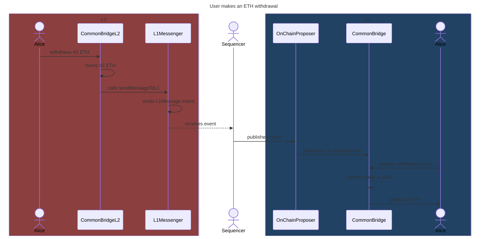
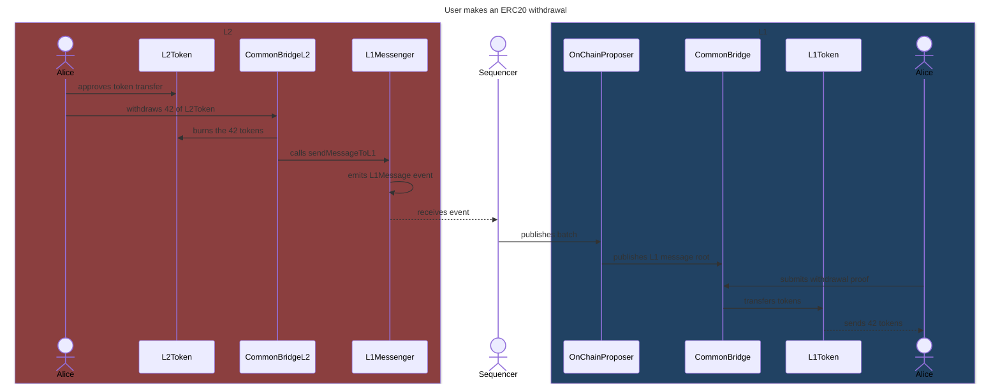

# Withdrawals

This document contains a detailed explanation of how asset withdrawals work.

## Native ETH withdrawals

This section explains step by step how native ETH withdrawals work.

On L2:

1. The user sends a transaction calling `withdraw(address _receiverOnL1)` on the `CommonBridgeL2` contract, along with the amount of ETH to be withdrawn.
2. The bridge sends the withdrawn amount to the burn address.
3. The bridge calls `sendMessageToL1(bytes32 data)` on the `L1Messenger` contract, with `data` being:

    ```solidity
    bytes32 data = keccak256(abi.encodePacked(ETH_ADDRESS, ETH_ADDRESS, _receiverOnL1, msg.value))
    ```

4. `L1Messenger` emits an `L1Message` event, with the address of the L2 bridge contract and `data` as topics.

On L1:

1. A sequencer commits the batch on L1, publishing the `L1Message` with `publishWithdrawals` on the L1 `CommonBridge`.
2. The user submits a withdrawal proof when calling `claimWithdrawal` on the L1 `CommonBridge`.
3. The bridge asserts the proof is valid.
4. The bridge sends the locked funds specified in the `L1Message` to the user.



## ERC20 withdrawals through the native bridge

This section explains step by step how native ERC20 withdrawals work.

On L2:

1. The user calls `approve` on the L2 tokens to allow the bridge to transfer the asset.
2. The user sends a transaction calling `withdrawERC20(address _token, address _receiverOnL1, uint256 _value)` on the `CommonBridgeL2` contract.
3. The bridge calls `burn` on the L2 token, burning the amount to be withdrawn by the user.
4. The bridge fetches the address of the L1 token by calling `l1Address()` on the L2 token contract.
5. The bridge calls `sendMessageToL1(bytes32 data)` on the `L1Messenger` contract, with `data` being:

    ```solidity
    // ETH_ADDRESS is an arbitrary and unreachable address
    bytes32 data = keccak256(abi.encodePacked(l1Token, _token, _receiverOnL1, _value))
    ```

6. `L1Messenger` emits an `L1Message` event, with the address of the L2 bridge contract and `data` as topics.

On L1:

1. A sequencer commits the batch on L1, publishing the `L1Message` with `publishWithdrawals` on the L1 `CommonBridge`.
2. The user submits a withdrawal proof when calling `claimWithdrawalERC20` on the L1 `CommonBridge`.
3. The bridge asserts the proof is valid and that the locked tokens mapping contains enough balance for the L1 and L2 token pair to cover the transfer.
4. The bridge transfers the locked tokens specified in the `L1Message` to the user and discounts the transferred amount from the L1 and L2 token pair in the mapping.


