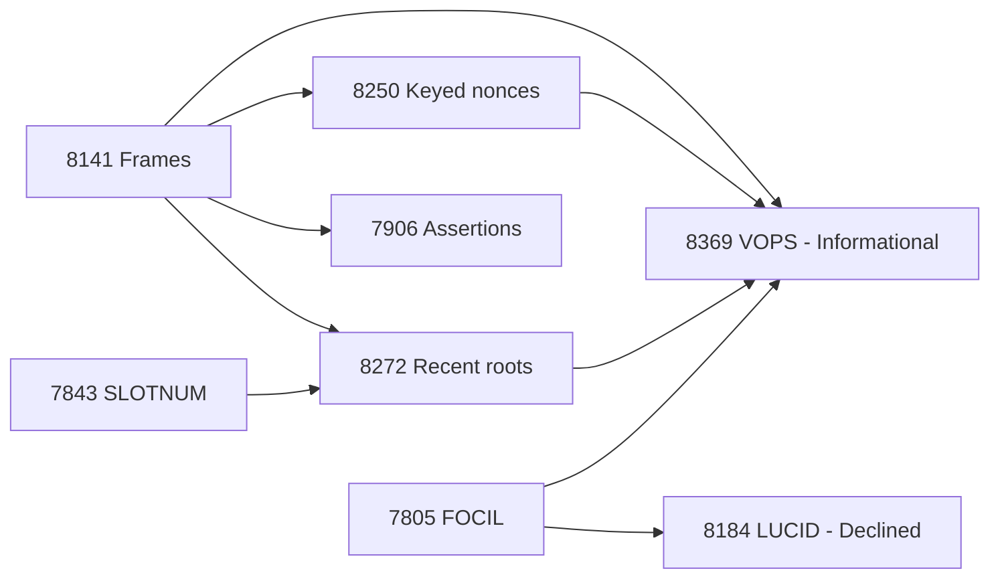
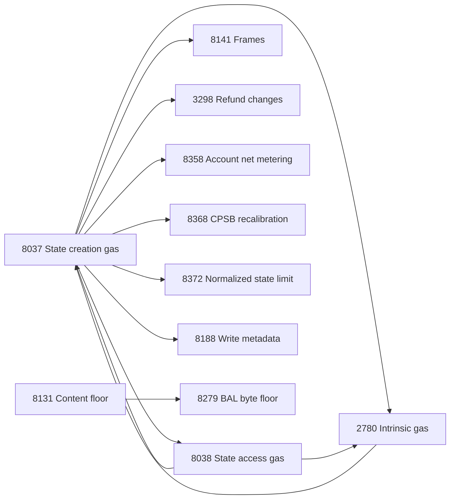
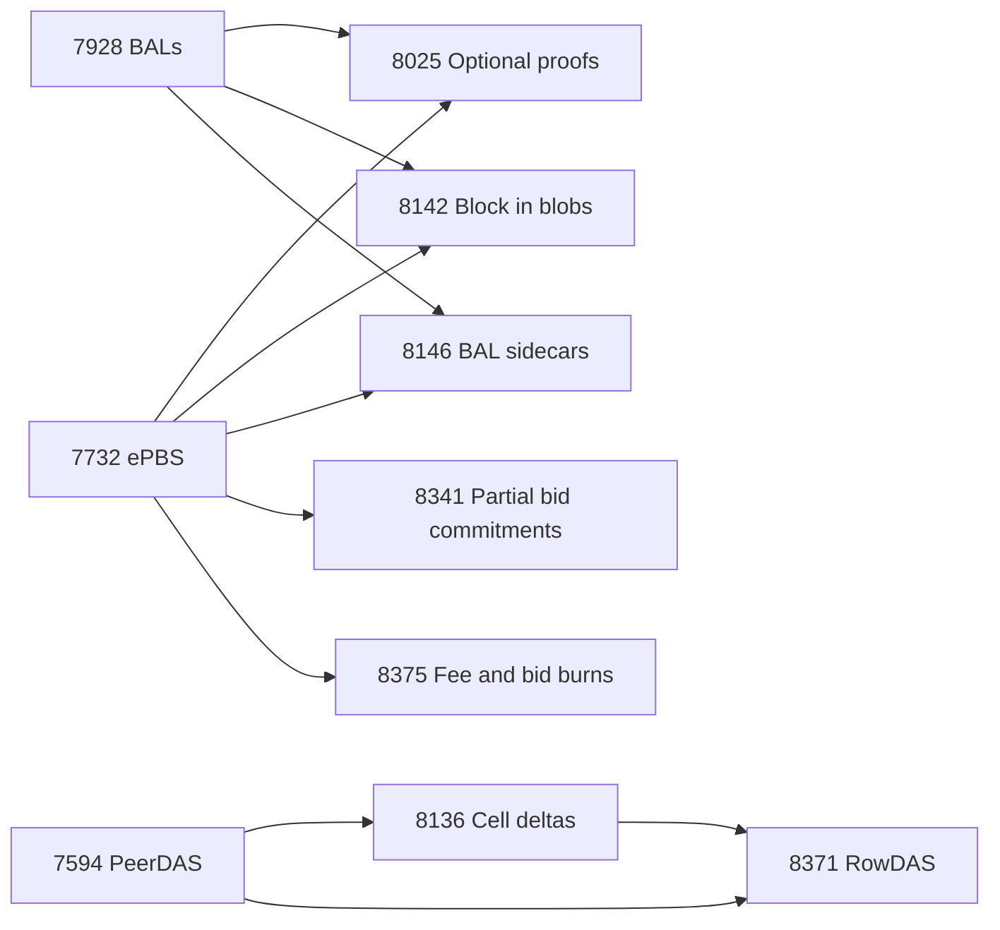
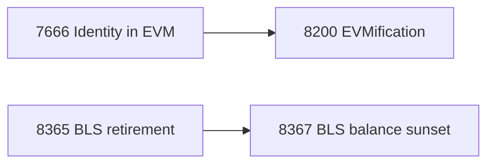

# Dependencies and interactions

[Overview](README.md) · [All proposal profiles](eips.md) · [Ethrex code map](ethrex.md)

There are three different relationships to track:

- **Declared prerequisite:** an EIP number appears in the proposal’s `requires` header. It may identify a prior-fork feature, a co-designed specification, or background referenced by an Informational EIP. It does not always define a serial implementation order.
- **Optional companion or overlapping design:** the proposals can support related use cases or solve overlapping problems, without requiring one another.
- **Composition issue:** both proposals alter the same rule or interface and require an agreed combined specification. An interaction is not proof that both cannot ship.

The diagrams below show declared prerequisites only, with arrows from prerequisite to dependent. In particular, 8369’s arrows describe an informational model; they do not make its proposed enforcement binding.

## Frames, FOCIL, and authorization

8141 defines transaction consensus validity and a narrower public-mempool validation policy. 7805 defines conditional omission checks for inclusion lists. Supporting Frames in a pool does not, by itself, establish how every programmable transaction is checked when omitted. 8369 explores bounded state/code profiles and replay at a builder-claimed position, but requires follow-up enforcement, commitments, bounds, and target-fork timing.

8250 supplies replay-independent keyed nonces, while 8272 makes recent shared roots eligible for bounded validation. They can help shared-sender/private applications without guaranteeing privacy or conflict-free execution. The current keyed-nonce proposal still permits only one pending public-pool transaction per sender.

7819, 7851, and 8298 are not prerequisites of Frames. They differ in who controls code and where the installed code comes from: a factory-derived delegation, a self-controlled delegation, or reuse of ordinary code. 8151 separately addresses contracts that authenticate with ecRecover. None of these eliminates bespoke signature-recovery logic.

## Gas and state foundations

This is a selected view, not every prerequisite. The full table below is authoritative for the captured headers. The 2780/8037/8038 cycle is real metadata: they form a jointly specified baseline, not three independent patches to order topologically.

| Foundation | Meaning for Hegotá review |
| --- | --- |
| 2780 | Splits state-independent intrinsic validity costs from state-dependent runtime charges. A runtime out-of-gas can produce a failed included transaction rather than invalidity. |
| 8037 | Separates state-creation gas from execution gas. Its legacy-envelope reservoir model differs from 8141’s explicit per-frame budgets. Captured CPSB is 1530. |
| 8038 | Separates access, write, and creation charges; captured ACCOUNT_WRITE is 9000 and STORAGE_WRITE is 10000. Older gas numbers in candidate drafts need reconciliation. |
| 7778 | Refunds reduce user payment without freeing equivalent block execution capacity. Do not use receipt/payment gas as a substitute for every block resource counter. |
| 7928 | BALs support prefetch and parallel/state reconstruction work. An advertised access list still needs correctness verification. |

The current 3298 removes the clearing incentive and refund cap while keeping write-reversal refunds. 8358 introduces account net metering; 8131 and 8279 establish byte floors; 8368 and 8372 reconsider state capacity. Assess the combined charging, refund, failure, and block-reservation rules rather than adding isolated gas savings. Gas claims must distinguish execution, raw state creation, user payment, and block capacity.

## ePBS, data availability, and proofs

7862 delays the state-root commitment in the block header. 8341 leaves final execution validity intact and removes two fields from the earlier bid commitment. Both target critical-path pressure, with different proof, sync, and header consequences; neither declares the other as a prerequisite.

8146 changes when/how a BAL arrives; 8142 commits payload contents through blobs; 8025 introduces optional execution proofs. Early data, available data, and valid execution are different properties. Their benefits are complementary, but the current headers do not make the three an inseparable package.

8371 adds row reconstruction over existing PeerDAS commitments. The historical [Partial Reconstruction and 2D PeerDAS proposal](https://ethereum-magicians.org/t/hegota-headliner-partial-reconstruction-and-2d-peerdas/27652) also discusses a second encoding dimension and cell sampling. The discussion explicitly distinguishes row reconstruction from 2D encoding. Preserve that distinction rather than treating the unnumbered headliner and RowDAS as one specification.

## Other direct in-roster relationships

Retirement can ship without the separate balance-burning policy. Identity replacement establishes the pattern used by 8200, whose other replacement bytecodes still need specification. These one-way relationships should remain visible when independently assessing the dependent proposal.

## Interactions that need explicit composition

These are findings from comparing the pinned sources, not additional `requires` edges. Some are definite textual discrepancies; others are integration questions that need validation.

| Proposals | Concrete issue to resolve |
| --- | --- |
| 8141 + 8250 | Base Frames now nests fees and declares two gas dimensions; the keyed-nonce draft reproduces an older flattened payload. Specify the combined wire/signing schema. |
| 8272 + 8369 | Recent roots now live in a canonical VERIFY frame; VOPS still discusses envelope roots and prefix matching that skips only expiry. Reconcile recognition, state views, and replay. |
| 8141 + 8374 | Current Frames restores reverted warm accesses; 8374 keeps them warm. Define the amended rule for calls, frames, and atomic batches. |
| 8141 + 3298 + 8358 | Refund cap, original-account baselines, payment approval, write reversal, and frame rollback must agree. State-gas refills are a separate mechanism. |
| 2780/8037/8038 + 5920/7819/8131/8151/8279 | Candidate drafts use older intrinsic, access, authorization, or account-creation prices. Rebase formulas and examples to one gas schedule. |
| 8038 + 8298 + 8358 | Captured 8038/8298 use a 9000 account-write price; 8358’s baseline/design differs. Specify the intended combined price rather than silently selecting one. |
| 8358 + existing CALL behavior | A minimum stipend floor differs from an additive 2300 stipend. Fixed-gas callers can receive less gas even if surrounding charges decrease. |
| 8115 + 8375 + 8141 | End-of-block fee credit, cumulative per-transaction tip burns, and Frame payer settlement need one ordering. Include transfer-log and BAL semantics. |
| 7668 + 7807 + 8116 + 8141 + 8304 | Bloom representation, receipt gas, nested frame logs, SSZ commitments, and log indices are separate interfaces. One proposal does not settle all the others. |
| 7862/8341 + 8237 + 8025 | Delayed roots, partial bid headers, sync commitments, and proof statements must authenticate the intended block/state at the intended stage. |
| 8025 summary + normative repositories | EIP text describes chain_id/schema_id in the EL result; the pinned EL uses chain_config, and CL PublicInput exposes only the request root. The pinned guest targets Amsterdam. Reconcile before Hegotá conformance work. |
| 7805 + 7732 + 8369 | Base FOCIL timing and ePBS reveal timing differ. AA omission checks need a post-reveal obligation or an explicitly disabled profile. |
| 8146 + block validation | Current sidecar draft requires a matching BAL before newPayload validation; designs that permit validation without waiting are not the captured rule. |
| 8077 + 8094 + 8250 + 8141 | Announced nonce identity, replacement, sidecar retrieval, and type-6 blobs must work together. Neither networking EIP automatically handles every new envelope. |
| 8243 + 8334 | Source signature aggregation and partial-message bundling alter overlapping gossip paths. Specify mixed-capability operation and deduplication without invalid-message poisoning. |
| 8321 + 8375 | Both propose domain 0x0F000000. 8375 explicitly marks it for deconfliction; allocate distinct domains before activation. |
| 8198 + 8363/8367/8383 | Eight-second slots change the wall-clock meaning of reward transitions, sunset epochs, and retention. Recompute the intended duration and security assumptions. |
| 7732 + 8341/8375 | These drafts contain same-fork ePBS assumptions. Hegotá activation after ePBS needs transition rules, including existing pending payments for 8375. |
| 8182 + authentication/privacy features | A different spend-authentication method does not replace the pool’s Groth16 proof or solve note delivery, root expiry, and public deposit/withdrawal linkability. |

## Baseline versus new implementation work

The source feed places ePBS, BALs, the gas foundation, SLOTNUM, and several request/data-structure changes in Glamsterdam. That records fork planning, not whether this ethrex branch fully implements each final specification. Use the local code and a pinned target fork to determine remaining work.

An EL implementation must still support integration with ostensibly CL proposals when they add request contracts, Engine fields, fees, or payload obligations. Conversely, client reporting, attestation gossip, and reward curves should not automatically be counted as LEVM implementation tasks. The profile for each EIP makes this distinction.

## Complete direct prerequisite table

These are header declarations, including old-fork foundations and informational references. “None” means no `requires` header; the proposal body may still assume other fork features. Arrows in the diagrams point from prerequisite to dependent.

| Proposal | Declared prerequisites |
| --- | --- |
| [2488](eips.md#eip-2488) | [7](https://eips.ethereum.org/EIPS/eip-7) |
| [3298](eips.md#eip-3298) | [2780](https://github.com/ethereum/EIPs/blob/991d932f52a56477753cd9f62114b842cd77275c/EIPS/eip-2780.md), [3529](https://eips.ethereum.org/EIPS/eip-3529), [7778](https://github.com/ethereum/EIPs/blob/991d932f52a56477753cd9f62114b842cd77275c/EIPS/eip-7778.md), [8037](https://github.com/ethereum/EIPs/blob/991d932f52a56477753cd9f62114b842cd77275c/EIPS/eip-8037.md), [8038](https://github.com/ethereum/EIPs/blob/991d932f52a56477753cd9f62114b842cd77275c/EIPS/eip-8038.md) |
| [4758](eips.md#eip-4758) | None |
| [5920](eips.md#eip-5920) | [214](https://eips.ethereum.org/EIPS/eip-214), [2929](https://eips.ethereum.org/EIPS/eip-2929), [7523](https://eips.ethereum.org/EIPS/eip-7523) |
| [7645](eips.md#eip-7645) | None |
| [7666](eips.md#eip-7666) | [3855](https://eips.ethereum.org/EIPS/eip-3855) |
| [7668](eips.md#eip-7668) | None |
| [7709](eips.md#eip-7709) | [2935](https://eips.ethereum.org/EIPS/eip-2935) |
| [7716](eips.md#eip-7716) | None |
| [7805](eips.md#eip-7805) | None |
| [7807](eips.md#eip-7807) | [7495](https://eips.ethereum.org/EIPS/eip-7495), [7773](https://eips.ethereum.org/EIPS/eip-7773), [7916](https://eips.ethereum.org/EIPS/eip-7916) |
| [7819](eips.md#eip-7819) | [7702](https://eips.ethereum.org/EIPS/eip-7702) |
| [7851](eips.md#eip-7851) | [7702](https://eips.ethereum.org/EIPS/eip-7702) |
| [7862](eips.md#eip-7862) | None |
| [7906](eips.md#eip-7906) | [2929](https://eips.ethereum.org/EIPS/eip-2929), [8141](eips.md#eip-8141) |
| [7923](eips.md#eip-7923) | None |
| [7979](eips.md#eip-7979) | None |
| [8015](eips.md#eip-8015) | [6110](https://eips.ethereum.org/EIPS/eip-6110), [7688](https://eips.ethereum.org/EIPS/eip-7688), [7773](https://eips.ethereum.org/EIPS/eip-7773) |
| [8025](eips.md#eip-8025) | [4844](https://eips.ethereum.org/EIPS/eip-4844), [6110](https://eips.ethereum.org/EIPS/eip-6110), [7002](https://eips.ethereum.org/EIPS/eip-7002), [7251](https://eips.ethereum.org/EIPS/eip-7251), [7688](https://eips.ethereum.org/EIPS/eip-7688), [7732](https://github.com/ethereum/EIPs/blob/991d932f52a56477753cd9f62114b842cd77275c/EIPS/eip-7732.md), [7928](https://github.com/ethereum/EIPs/blob/991d932f52a56477753cd9f62114b842cd77275c/EIPS/eip-7928.md), [8282](https://eips.ethereum.org/EIPS/eip-8282) |
| [8077](eips.md#eip-8077) | [7642](https://eips.ethereum.org/EIPS/eip-7642) |
| [8094](eips.md#eip-8094) | [7642](https://eips.ethereum.org/EIPS/eip-7642) |
| [8105](eips.md#eip-8105) | [7732](https://github.com/ethereum/EIPs/blob/991d932f52a56477753cd9f62114b842cd77275c/EIPS/eip-7732.md) |
| [8115](eips.md#eip-8115) | [1559](https://eips.ethereum.org/EIPS/eip-1559), [4895](https://eips.ethereum.org/EIPS/eip-4895) |
| [8116](eips.md#eip-8116) | None |
| [8131](eips.md#eip-8131) | [2028](https://eips.ethereum.org/EIPS/eip-2028), [4844](https://eips.ethereum.org/EIPS/eip-4844), [7623](https://eips.ethereum.org/EIPS/eip-7623), [7702](https://eips.ethereum.org/EIPS/eip-7702), [7976](https://eips.ethereum.org/EIPS/eip-7976), [7981](https://eips.ethereum.org/EIPS/eip-7981) |
| [8141](eips.md#eip-8141) | [1559](https://eips.ethereum.org/EIPS/eip-1559), [2718](https://eips.ethereum.org/EIPS/eip-2718), [2780](https://github.com/ethereum/EIPs/blob/991d932f52a56477753cd9f62114b842cd77275c/EIPS/eip-2780.md), [3529](https://eips.ethereum.org/EIPS/eip-3529), [3607](https://eips.ethereum.org/EIPS/eip-3607), [4844](https://eips.ethereum.org/EIPS/eip-4844), [7594](https://eips.ethereum.org/EIPS/eip-7594), [7623](https://eips.ethereum.org/EIPS/eip-7623), [7702](https://eips.ethereum.org/EIPS/eip-7702), [7708](https://eips.ethereum.org/EIPS/eip-7708), [7778](https://github.com/ethereum/EIPs/blob/991d932f52a56477753cd9f62114b842cd77275c/EIPS/eip-7778.md), [7825](https://eips.ethereum.org/EIPS/eip-7825), [8037](https://github.com/ethereum/EIPs/blob/991d932f52a56477753cd9f62114b842cd77275c/EIPS/eip-8037.md) |
| [8142](eips.md#eip-8142) | [4844](https://eips.ethereum.org/EIPS/eip-4844), [7594](https://eips.ethereum.org/EIPS/eip-7594), [7732](https://github.com/ethereum/EIPs/blob/991d932f52a56477753cd9f62114b842cd77275c/EIPS/eip-7732.md), [7892](https://eips.ethereum.org/EIPS/eip-7892), [7928](https://github.com/ethereum/EIPs/blob/991d932f52a56477753cd9f62114b842cd77275c/EIPS/eip-7928.md) |
| [8146](eips.md#eip-8146) | [7732](https://github.com/ethereum/EIPs/blob/991d932f52a56477753cd9f62114b842cd77275c/EIPS/eip-7732.md), [7928](https://github.com/ethereum/EIPs/blob/991d932f52a56477753cd9f62114b842cd77275c/EIPS/eip-7928.md) |
| [8148](eips.md#eip-8148) | [7251](https://eips.ethereum.org/EIPS/eip-7251), [7685](https://eips.ethereum.org/EIPS/eip-7685) |
| [8151](eips.md#eip-8151) | [2929](https://eips.ethereum.org/EIPS/eip-2929), [3607](https://eips.ethereum.org/EIPS/eip-3607), [7702](https://eips.ethereum.org/EIPS/eip-7702) |
| [8163](eips.md#eip-8163) | [141](https://eips.ethereum.org/EIPS/eip-141) |
| [8173](eips.md#eip-8173) | None |
| [8182](eips.md#eip-8182) | [20](https://eips.ethereum.org/EIPS/eip-20) |
| [8184](eips.md#eip-8184) | [2718](https://eips.ethereum.org/EIPS/eip-2718), [7805](eips.md#eip-7805) |
| [8188](eips.md#eip-8188) | [8037](https://github.com/ethereum/EIPs/blob/991d932f52a56477753cd9f62114b842cd77275c/EIPS/eip-8037.md) |
| [8198](eips.md#eip-8198) | [7892](https://eips.ethereum.org/EIPS/eip-7892) |
| [8200](eips.md#eip-8200) | [152](https://eips.ethereum.org/EIPS/eip-152), [7666](eips.md#eip-7666), [7823](https://eips.ethereum.org/EIPS/eip-7823), [7883](https://eips.ethereum.org/EIPS/eip-7883) |
| [8205](eips.md#eip-8205) | [6110](https://eips.ethereum.org/EIPS/eip-6110), [7685](https://eips.ethereum.org/EIPS/eip-7685), [7732](https://github.com/ethereum/EIPs/blob/991d932f52a56477753cd9f62114b842cd77275c/EIPS/eip-7732.md) |
| [8219](eips.md#eip-8219) | None |
| [8237](eips.md#eip-8237) | [7732](https://github.com/ethereum/EIPs/blob/991d932f52a56477753cd9f62114b842cd77275c/EIPS/eip-7732.md) |
| [8243](eips.md#eip-8243) | None |
| [8250](eips.md#eip-8250) | [7623](https://eips.ethereum.org/EIPS/eip-7623), [8037](https://github.com/ethereum/EIPs/blob/991d932f52a56477753cd9f62114b842cd77275c/EIPS/eip-8037.md), [8141](eips.md#eip-8141) |
| [8253](eips.md#eip-8253) | [161](https://eips.ethereum.org/EIPS/eip-161), [684](https://eips.ethereum.org/EIPS/eip-684) |
| [8272](eips.md#eip-8272) | [7843](https://github.com/ethereum/EIPs/blob/991d932f52a56477753cd9f62114b842cd77275c/EIPS/eip-7843.md), [8141](eips.md#eip-8141) |
| [8279](eips.md#eip-8279) | [7623](https://eips.ethereum.org/EIPS/eip-7623), [7702](https://eips.ethereum.org/EIPS/eip-7702), [7928](https://github.com/ethereum/EIPs/blob/991d932f52a56477753cd9f62114b842cd77275c/EIPS/eip-7928.md), [7976](https://eips.ethereum.org/EIPS/eip-7976), [7981](https://eips.ethereum.org/EIPS/eip-7981), [8131](eips.md#eip-8131) |
| [8298](eips.md#eip-8298) | [3529](https://eips.ethereum.org/EIPS/eip-3529), [3607](https://eips.ethereum.org/EIPS/eip-3607), [6780](https://eips.ethereum.org/EIPS/eip-6780), [7702](https://eips.ethereum.org/EIPS/eip-7702), [8037](https://github.com/ethereum/EIPs/blob/991d932f52a56477753cd9f62114b842cd77275c/EIPS/eip-8037.md), [8038](https://github.com/ethereum/EIPs/blob/991d932f52a56477753cd9f62114b842cd77275c/EIPS/eip-8038.md) |
| [8304](eips.md#eip-8304) | [4788](https://eips.ethereum.org/EIPS/eip-4788) |
| [8321](eips.md#eip-8321) | [7916](https://eips.ethereum.org/EIPS/eip-7916) |
| [8333](eips.md#eip-8333) | None |
| [8334](eips.md#eip-8334) | None |
| [8341](eips.md#eip-8341) | [7732](https://github.com/ethereum/EIPs/blob/991d932f52a56477753cd9f62114b842cd77275c/EIPS/eip-7732.md) |
| [8355](eips.md#eip-8355) | None |
| [8358](eips.md#eip-8358) | [161](https://eips.ethereum.org/EIPS/eip-161), [2200](https://eips.ethereum.org/EIPS/eip-2200), [2780](https://github.com/ethereum/EIPs/blob/991d932f52a56477753cd9f62114b842cd77275c/EIPS/eip-2780.md), [2929](https://eips.ethereum.org/EIPS/eip-2929), [3529](https://eips.ethereum.org/EIPS/eip-3529), [7702](https://eips.ethereum.org/EIPS/eip-7702), [7708](https://eips.ethereum.org/EIPS/eip-7708), [8037](https://github.com/ethereum/EIPs/blob/991d932f52a56477753cd9f62114b842cd77275c/EIPS/eip-8037.md), [8038](https://github.com/ethereum/EIPs/blob/991d932f52a56477753cd9f62114b842cd77275c/EIPS/eip-8038.md) |
| [8359](eips.md#eip-8359) | None |
| [8363](eips.md#eip-8363) | None |
| [8365](eips.md#eip-8365) | [6110](https://eips.ethereum.org/EIPS/eip-6110), [7251](https://eips.ethereum.org/EIPS/eip-7251), [7732](https://github.com/ethereum/EIPs/blob/991d932f52a56477753cd9f62114b842cd77275c/EIPS/eip-7732.md) |
| [8367](eips.md#eip-8367) | [8365](eips.md#eip-8365) |
| [8368](eips.md#eip-8368) | [8037](https://github.com/ethereum/EIPs/blob/991d932f52a56477753cd9f62114b842cd77275c/EIPS/eip-8037.md) |
| [8369](eips.md#eip-8369) | [1559](https://eips.ethereum.org/EIPS/eip-1559), [2718](https://eips.ethereum.org/EIPS/eip-2718), [2930](https://eips.ethereum.org/EIPS/eip-2930), [3607](https://eips.ethereum.org/EIPS/eip-3607), [4844](https://eips.ethereum.org/EIPS/eip-4844), [7702](https://eips.ethereum.org/EIPS/eip-7702), [7732](https://github.com/ethereum/EIPs/blob/991d932f52a56477753cd9f62114b842cd77275c/EIPS/eip-7732.md), [7805](eips.md#eip-7805), [7843](https://github.com/ethereum/EIPs/blob/991d932f52a56477753cd9f62114b842cd77275c/EIPS/eip-7843.md), [7928](https://github.com/ethereum/EIPs/blob/991d932f52a56477753cd9f62114b842cd77275c/EIPS/eip-7928.md), [8141](eips.md#eip-8141), [8250](eips.md#eip-8250), [8272](eips.md#eip-8272) |
| [8371](eips.md#eip-8371) | [7594](https://eips.ethereum.org/EIPS/eip-7594), [8136](https://github.com/ethereum/EIPs/blob/991d932f52a56477753cd9f62114b842cd77275c/EIPS/eip-8136.md) |
| [8372](eips.md#eip-8372) | [8037](https://github.com/ethereum/EIPs/blob/991d932f52a56477753cd9f62114b842cd77275c/EIPS/eip-8037.md) |
| [8374](eips.md#eip-8374) | [2929](https://eips.ethereum.org/EIPS/eip-2929) |
| [8375](eips.md#eip-8375) | [7732](https://github.com/ethereum/EIPs/blob/991d932f52a56477753cd9f62114b842cd77275c/EIPS/eip-7732.md) |
| [8379](eips.md#eip-8379) | None |
| [8383](eips.md#eip-8383) | None |

## Prerequisites outside the Hegotá roster

These 50 direct prerequisites are context, not extra Hegotá candidates. Statuses are the captured Forkcast fork relationships; “Scheduled” is a planning stage, not evidence of mainnet activation.

| EIP | Foundation | Forkcast context |
| --- | --- | --- |
| [7](https://eips.ethereum.org/EIPS/eip-7) | DELEGATECALL | No fork relationship in captured feed |
| [20](https://eips.ethereum.org/EIPS/eip-20) | ERC-20 Token Standard | No fork relationship in captured feed |
| [141](https://eips.ethereum.org/EIPS/eip-141) | Designated invalid EVM instruction | No fork relationship in captured feed |
| [152](https://eips.ethereum.org/EIPS/eip-152) | Add BLAKE2 compression function `F` precompile | No fork relationship in captured feed |
| [161](https://eips.ethereum.org/EIPS/eip-161) | State trie clearing (invariant-preserving alternative) | No fork relationship in captured feed |
| [214](https://eips.ethereum.org/EIPS/eip-214) | New opcode STATICCALL | No fork relationship in captured feed |
| [684](https://eips.ethereum.org/EIPS/eip-684) | Revert creation in case of collision | No fork relationship in captured feed |
| [1559](https://eips.ethereum.org/EIPS/eip-1559) | Fee market change for ETH 1.0 chain | No fork relationship in captured feed |
| [2028](https://eips.ethereum.org/EIPS/eip-2028) | Transaction data gas cost reduction | No fork relationship in captured feed |
| [2200](https://eips.ethereum.org/EIPS/eip-2200) | Structured Definitions for Net Gas Metering | No fork relationship in captured feed |
| [2718](https://eips.ethereum.org/EIPS/eip-2718) | Typed Transaction Envelope | No fork relationship in captured feed |
| [2780](https://github.com/ethereum/EIPs/blob/991d932f52a56477753cd9f62114b842cd77275c/EIPS/eip-2780.md) | Resource-based intrinsic transaction gas | Glamsterdam: Scheduled |
| [2929](https://eips.ethereum.org/EIPS/eip-2929) | Gas cost increases for state access opcodes | No fork relationship in captured feed |
| [2930](https://eips.ethereum.org/EIPS/eip-2930) | Optional access lists | No fork relationship in captured feed |
| [2935](https://eips.ethereum.org/EIPS/eip-2935) | Serve historical block hashes from state | Pectra: Included |
| [3529](https://eips.ethereum.org/EIPS/eip-3529) | Reduction in refunds | No fork relationship in captured feed |
| [3607](https://eips.ethereum.org/EIPS/eip-3607) | Reject transactions from senders with deployed code | No fork relationship in captured feed |
| [3855](https://eips.ethereum.org/EIPS/eip-3855) | PUSH0 instruction | No fork relationship in captured feed |
| [4788](https://eips.ethereum.org/EIPS/eip-4788) | Beacon block root in the EVM | No fork relationship in captured feed |
| [4844](https://eips.ethereum.org/EIPS/eip-4844) | Shard Blob Transactions | Dencun: Included |
| [4895](https://eips.ethereum.org/EIPS/eip-4895) | Beacon chain push withdrawals as operations | No fork relationship in captured feed |
| [6110](https://eips.ethereum.org/EIPS/eip-6110) | Supply validator deposits on chain | Pectra: Included |
| [6780](https://eips.ethereum.org/EIPS/eip-6780) | SELFDESTRUCT only in same transaction | No fork relationship in captured feed |
| [7002](https://eips.ethereum.org/EIPS/eip-7002) | Execution layer triggerable withdrawals | Pectra: Included |
| [7251](https://eips.ethereum.org/EIPS/eip-7251) | Increase the MAX_EFFECTIVE_BALANCE | Pectra: Included |
| [7495](https://eips.ethereum.org/EIPS/eip-7495) | SSZ ProgressiveContainer | No fork relationship in captured feed |
| [7523](https://eips.ethereum.org/EIPS/eip-7523) | Empty accounts deprecation | No fork relationship in captured feed |
| [7594](https://eips.ethereum.org/EIPS/eip-7594) | PeerDAS - Peer Data Availability Sampling | Fusaka: Included |
| [7623](https://eips.ethereum.org/EIPS/eip-7623) | Increase calldata cost | Pectra: Included |
| [7642](https://eips.ethereum.org/EIPS/eip-7642) | eth/69 - history expiry and simpler receipts | Pectra: Included; Fusaka: Included |
| [7685](https://eips.ethereum.org/EIPS/eip-7685) | General purpose execution layer requests | Pectra: Included |
| [7688](https://eips.ethereum.org/EIPS/eip-7688) | Forward compatible consensus data structures | Fusaka: Declined; Glamsterdam: Scheduled |
| [7702](https://eips.ethereum.org/EIPS/eip-7702) | Set Code for EOAs | Pectra: Included |
| [7708](https://eips.ethereum.org/EIPS/eip-7708) | ETH transfers emit a log | Glamsterdam: Scheduled |
| [7732](https://github.com/ethereum/EIPs/blob/991d932f52a56477753cd9f62114b842cd77275c/EIPS/eip-7732.md) | Enshrined Proposer-Builder Separation | Fusaka: Declined; Glamsterdam: Scheduled |
| [7773](https://eips.ethereum.org/EIPS/eip-7773) | Hardfork Meta - Glamsterdam | No fork relationship in captured feed |
| [7778](https://github.com/ethereum/EIPs/blob/991d932f52a56477753cd9f62114b842cd77275c/EIPS/eip-7778.md) | Block Gas Accounting without Refunds | Glamsterdam: Scheduled |
| [7823](https://eips.ethereum.org/EIPS/eip-7823) | Set upper bounds for MODEXP | Fusaka: Included |
| [7825](https://eips.ethereum.org/EIPS/eip-7825) | Transaction Gas Limit Cap | Fusaka: Included |
| [7843](https://github.com/ethereum/EIPs/blob/991d932f52a56477753cd9f62114b842cd77275c/EIPS/eip-7843.md) | SLOTNUM opcode | Fusaka: Declined; Glamsterdam: Scheduled |
| [7883](https://eips.ethereum.org/EIPS/eip-7883) | ModExp Gas Cost Increase | Fusaka: Included |
| [7892](https://eips.ethereum.org/EIPS/eip-7892) | Blob Parameter Only Hardforks | Fusaka: Included |
| [7916](https://eips.ethereum.org/EIPS/eip-7916) | SSZ ProgressiveList | No fork relationship in captured feed |
| [7928](https://github.com/ethereum/EIPs/blob/991d932f52a56477753cd9f62114b842cd77275c/EIPS/eip-7928.md) | Block-Level Access Lists | Glamsterdam: Scheduled |
| [7976](https://eips.ethereum.org/EIPS/eip-7976) | Increase Calldata Floor Cost | Glamsterdam: Scheduled |
| [7981](https://eips.ethereum.org/EIPS/eip-7981) | Increase Access List Cost | Glamsterdam: Scheduled |
| [8037](https://github.com/ethereum/EIPs/blob/991d932f52a56477753cd9f62114b842cd77275c/EIPS/eip-8037.md) | State Creation Gas Cost Increase | Glamsterdam: Scheduled |
| [8038](https://github.com/ethereum/EIPs/blob/991d932f52a56477753cd9f62114b842cd77275c/EIPS/eip-8038.md) | State-access gas cost update | Glamsterdam: Scheduled |
| [8136](https://github.com/ethereum/EIPs/blob/991d932f52a56477753cd9f62114b842cd77275c/EIPS/eip-8136.md) | Cell-Level Deltas for Data Column Broadcast | Glamsterdam: Networking |
| [8282](https://eips.ethereum.org/EIPS/eip-8282) | Builder Execution Requests | Glamsterdam: Scheduled |

The machine-readable [dependency graph](dependencies.json) includes transitive header references. Cycles found in this closure: [2780](https://github.com/ethereum/EIPs/blob/991d932f52a56477753cd9f62114b842cd77275c/EIPS/eip-2780.md), [8037](https://github.com/ethereum/EIPs/blob/991d932f52a56477753cd9f62114b842cd77275c/EIPS/eip-8037.md), [8038](https://github.com/ethereum/EIPs/blob/991d932f52a56477753cd9f62114b842cd77275c/EIPS/eip-8038.md). These are co-referencing specifications, so `requires` should not be interpreted as a strict serial implementation order.
