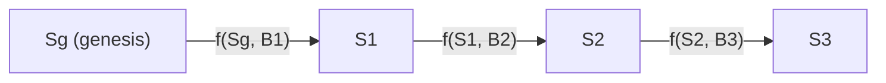
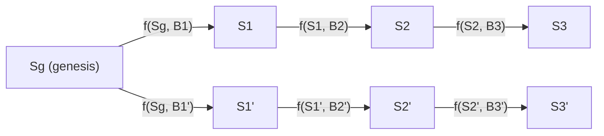

# Node code quick-guide by example

This document covers how the code in the node is organized by looking at different end to end flows. If we start too high level we’ll need to start at consensus, and if we start too low level, we’ll need to start at the EVM. Let’s start somewhere in the middle: importing blocks.

## Importing blocks

The simplest task a node can do is import blocks offline. We would do so like this:

```bash
# Build in release mode
cargo build --release --bin ethrex

# Execute the import
./target/release/ethrex --network cmd/ethrex/networks/hoodi/genesis.json import test_data/hoodi-blocks-first-thousand.rlp
```

- The network argument is common to all ethrex commands. It specifies the genesis file, or a public network like holesky. This is the starting state of the blockchain.
- The import command means that this node will not start rpc endpoints or peer to peer communication. It will just read a file, parse the blocks, execute them, and save the EVM state (accounts info and storage) after each execution.
- The file is an RLP encoded file with a list of blocks.

### Block execution

The CLI import subcommand executes `cmd/ethrex/cli.rs:import_blocks`, which can be summarized as:

```rust
let store = init_store(&data_dir, network).await;
let blockchain = init_blockchain(evm, store.clone());
for block in parse(rlp_file) {
    blockchain.add_block(block)
}
```

The blockchain struct is our main point of interaction with our data. It contains references to key structures like our store (key-value db) and the EVM engine (knows how to execute transactions).

Adding a block is performed in `crates/blockchain/blockchain.rs:add_block`, and performs several tasks:

1. Block execution (`execute_block`).
   1. Pre-validation. Checks that the block parent is present, that the base fee matches the parent's expectations, timestamps, header number, transaction root and withdrawals root.
   2. VM execution. The block contains all the transactions, which is all needed to perform a state transition. The VM has a reference to the store, so it can get the current state to apply transactions on top of it.
   3. Post execution validations: gas used, receipts root, requets hash.
   4. The VM execution does not mutate the store itself. It returns a list of all changes that happened in execution so they can be applied in any custom way.
2. Post-state storage (`store_block`)
   1. `apply_account_updates` gets the pre-state fro the store, applies the updates to get an updated post-transition-state, calculates the root and commits the new state to disk.
   2. The state root is a merkle root, a cryptographic summary of a state. The one we just calculated is compared with the one in the block header. If it matches, it prooves that your node's post state is the same as the one the block producer reached after executing that same block.
   3. The block and the receipts are saved to disk.

### States

In ethereum the first state is determined by the genesis file. After that, each block represents a state transition. To be formal about it, if we have a state $S$ and a block $B$, we can define $B' = f(S,B)$ as the application of a state transition function.

This means that a blockchain, internally, looks like this.



We start from a genesis state, and each time we add a block we generate a new state. We don't only save the current state ($S_3$), we save all of them in the DB after execution. This seems wasteful, but the reason will become more obvious very soon. This means that we can get the state for any block number. We say that if we get the state for block number one, we actually are getting the state right after applying `B1`.

Due to the highly available nature of ethereum, sometimes multiple different blocks can be proposed for a single state. This creates what we call "soft forks".



This means that for a single block number we actually have different post states, depending on which block we executed. In turn, this means that using a block number is not a reliable way of getting a state. To fix this, what we do is calculate the hash of a block, which is unique, and use that as an identifier for both the block and its corresponding block state. In that way, if I request the DB the state for `hash(B1)` it understands that I'm looking for `S1`, whereas if I request the DB the state for `hash(B1')` I'm looking for `S1'`.

How we determine which is the right fork is called **Fork choice**, which is not done by the execution client, but by the consensus client. What concerns to us is that if we currently think we are on `S3` and the consensus client notifies us that actually `S3'` is the current fork, we need to change our current state to that one. That means that we need to save every post-state in case we need to change forks. This changing of the nodes perception of the correct soft fork to a different one is called **reorg**.

### VM - State interaction

As mentioned in the previous point, the VM execution doesn't directly mutate the store. It just calculates all necessary updates. But this left out some important points. How does it get the current state? What even is the state?

This is a key piece of code in `Blockchain.execute_block`:

```rust
let vm_db = StoreVmDatabase::new(self.storage.clone(), block.header.parent_hash);
let mut vm = Evm::new(self.evm_engine, vm_db);
let execution_result = vm.execute_block(block)?;
let account_updates = vm.get_state_transitions()?;
```

The VM is a transient object. It is created with an engine/backend (LEVM or REVM) and a db reference. It is discarded after executing each block. 

The `StoreVmDatabase` is just an implementation of the `VmDatabase` trait, using our `Store` (reference to a key-value store). It's an adapter between the the store and the vm and allows the VM to not depend on a concrete DB. 

The main piece of context a VM DB needs to be created is the `parent_hash`, which is the hash of the parent's block. As we mentioned previously, this hash uniquely identifies an ethereum state, so we are basically telling the VM what it's pre-state is. If we give it that, plus the block, the VM can execute the state-transition function $S' = f(S, B)$ previously mentioned.

# TODO

Imports

- StoreVmDatabase (what state does the store need)
- Trie vs snapshots in a summary.
- What account updates are. What does it mean to apply them.
  
Live node block execution

- Engine api endpoints (fork choice updated with no attrs, new payload).
- applying fork choice and reorg.
- JSON RPC endpoints to get state.

Block building

- Mempool and P2P.
- Fork choice updated with attributes and get_payload.
- Payload building.

Syncing on node startup

- Discovery.
- Getting blocks and headers via p2p.
- Snap sync.